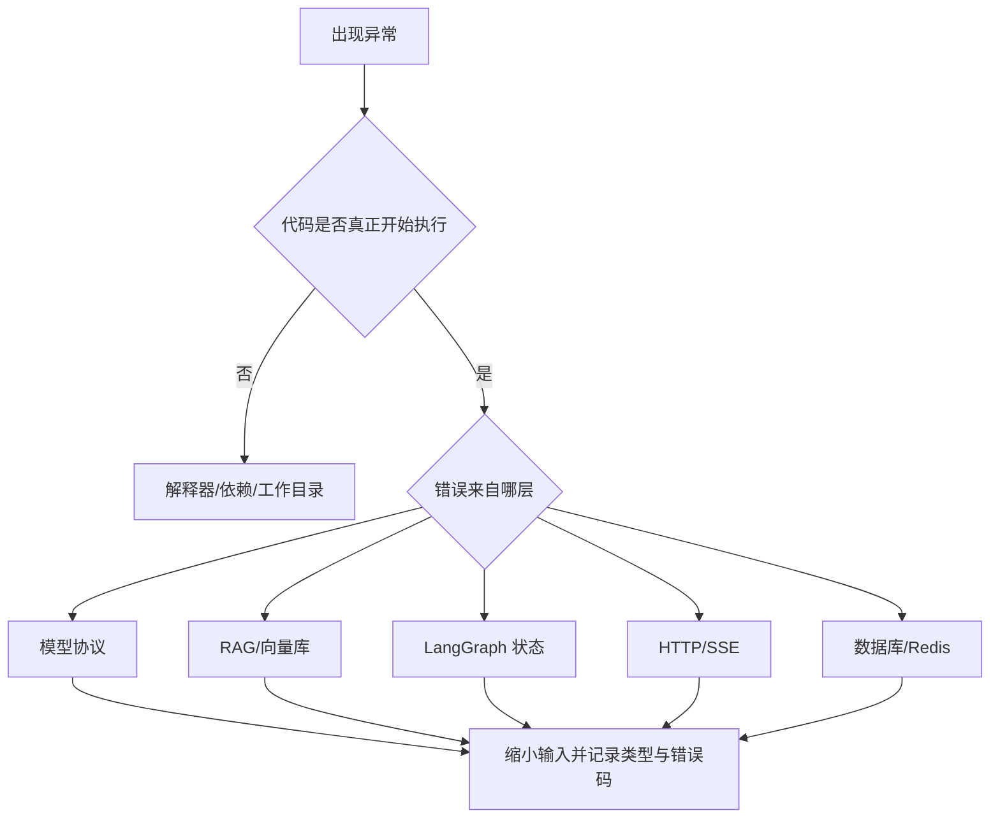

# 常见错误排查

## 固定顺序

1. 找到异常类型和第一条属于自己代码的堆栈。
2. 确认 PyCharm 解释器与终端执行的 Python 是否属于同一个 `.venv`。
3. 确认命令的工作目录，以及相对路径从哪里开始计算。
4. 打印类型、长度、字段名和状态，不打印密钥或完整业务数据。
5. 用最小输入复现，再检查网络、模型和数据库。

## 常见类别

| 现象 | 优先检查 |
| --- | --- |
| import 爆红但终端可运行 | PyCharm 解释器是否选择项目 `.venv` |
| `No such file or directory` | 当前工作目录和相对路径 |
| Prompt 缺少变量 | 模板中的 `{name}` 是否都由输入提供 |
| 模型返回 400 | 模型是否支持当前 `tool_choice`、结构化输出或 thinking 模式组合 |
| RAG 没有结果 | 文档是否入库、Embedding 是否一致、过滤条件是否过严 |
| LangGraph 无法恢复 | 是否配置 Checkpointer，并复用相同 `thread_id` |
| SSE 一次性返回 | 中间代理或 Java 转发是否发生缓冲 |
| 工具似乎没有执行 | `AIMessage.tool_calls` 是否存在，应用是否完成分发与 `ToolMessage` 回传 |
| Qdrant 跨租户无结果 | Filter 字段路径、metadata 嵌套结构和可信 `tenant_id` 是否一致 |
| `interrupt` 后重复副作用 | 副作用是否发生在暂停之前，恢复时节点是否重新执行 |
| Redis 故障后退款仍放行 | 写操作的幂等依赖是否错误采用 fail-open |

## 最小诊断信息

可以记录：异常类型、稳定错误码、`request_id`、节点名、工具名、输入类型、集合名、耗时和 HTTP 状态。

不应记录：API Key、完整鉴权头、真实密码、完整 Prompt、知识库正文、完整用户隐私数据或数据库连接字符串。
