# 第 2 章：Java 开发者所需的 Python、uv、异步与 FastAPI

> 本章状态：内容完成。最近复核：2026-09-08。关键依赖：FastAPI 0.141.1、Uvicorn 0.52.4、Pydantic 2.13.5。

## 1. 本章解决的问题

后续的 LangChain、LangGraph、RAG 示例会使用 Python 和 FastAPI，但没有必要先把 Python 生态全部学完。本章只建立 Agent 工程必须具备的最小能力：

- 在 `uv` 项目中管理依赖并稳定运行命令；
- 看懂函数、类型标注、模块和数据模型；
- 判断何时使用 `def`、`async def` 和 `await`；
- 用 FastAPI 定义一个有请求校验和响应边界的 HTTP API；
- 理解 Uvicorn、FastAPI 和业务函数在一次请求中的分工。

本章不讲 Python 元类、装饰器实现原理、协程调度器细节、完整 Web 安全体系或 FastAPI 的全部功能。这些内容只有在后续 Agent 服务需要时才展开。

## 2. 背景与技术动机

企业 Agent 中，Java 后端通常保留认证、授权、交易、订单、库存和领域事务；Python 服务适合承载模型调用、检索和工作流编排。两者通过 HTTP、SSE 或消息队列协作，而不是互相替代。

Python 的难点不在语法数量，而在运行模型与 Java 不同：代码通常直接由解释器执行，模块按导入加载，类型标注主要服务于编辑器、静态检查和框架。`uv` 负责把“项目声明的依赖”转换成“可复现的具体环境”；FastAPI 则利用类型标注把 HTTP 请求转换为可校验的数据对象。

## 3. 核心心智模型

### 3.1 Python 类型标注不是 Java 编译期类型系统

```python
def normalize(text: str) -> str:
    return text.strip()
```

`text: str` 和 `-> str` 是类型标注。Python 解释器不会像 Java 编译器那样仅凭它们拒绝所有错误调用；但 PyCharm、Ruff、Pyright 和 FastAPI 等工具会读取它们。FastAPI 再结合 Pydantic 才会在 HTTP 边界执行请求数据校验。

因此需要区分：

| 层次 | 例子 | 作用 |
| --- | --- | --- |
| Python 语法 | `def`、缩进、`import` | 定义并执行代码 |
| 类型标注 | `message: str`、`str | None` | 表达期望类型，帮助工具和框架 |
| Pydantic 约束 | `Field(min_length=1)` | 在模型构造时校验数据 |
| 业务规则 | “退款必须由订单服务确认” | 由业务服务实现，不能只靠数据模型 |

### 3.2 `uv` 管理项目，不是另一个 `pip`

一个 uv 项目的三个核心文件是：

```text
pyproject.toml  -> 声明项目、Python 版本范围与依赖约束
uv.lock         -> 锁定本次解析出的精确依赖版本
.venv/          -> 当前机器实际安装的项目环境，不提交 Git
```

可以粗略类比为 Maven/Gradle：`pyproject.toml` 类似依赖声明，`uv.lock` 类似可复现构建所需的精确解析结果，`.venv` 类似本地构建环境。类比的边界是：Python 项目不会产生 JVM 的 classpath；`.venv` 是一个包含 Python 解释器与 site-packages 的隔离目录。

常用命令只需先记住四个：

| 命令 | 做什么 | 何时使用 |
| --- | --- | --- |
| `uv add fastapi` | 修改依赖声明并更新锁文件/环境 | 新增项目依赖 |
| `uv sync --locked` | 严格按 `uv.lock` 同步环境 | 克隆项目、CI、验证可复现性 |
| `uv run pytest` | 在项目锁定环境中运行命令 | 运行测试、脚本、服务器 |
| `uv lock --upgrade` | 根据约束更新锁定版本 | 有计划地升级依赖 |

不要用 `uv pip install` 代替 `uv add` 管理课程项目依赖。前者可修改当前环境，却不一定同步项目声明；团队成员或 CI 就无法复现该环境。

### 3.3 `async` 解决等待期间的并发，不让 CPU 自动变快

调用 `async def` 函数不会立刻得到最终值，而是得到一个 coroutine（协程对象）。在另一个协程中使用 `await`，或在脚本入口使用 `asyncio.run()`，才会驱动它执行：

```python
async def fetch() -> str:
    return "result"

result = await fetch()
```

`await` 的含义是：当前协程在等待一个**可等待对象**完成时，把执行权交还给事件循环，让同一线程可以处理其他就绪任务。它不是“创建新线程”，也不是“任何代码加上 async 都会更快”。

选择规则：

| 代码类型 | 推荐写法 | 原因 |
| --- | --- | --- |
| 使用异步 HTTP、异步数据库或异步模型客户端 | `async def` + `await` | I/O 等待期间可以处理其他请求 |
| 使用只有同步接口的阻塞库 | 普通 `def`，或明确移到线程/进程 | 避免在事件循环中直接阻塞 |
| 大量 CPU 计算 | 进程、任务队列或专门计算服务 | `async` 不能解除 CPU 饱和 |
| 普通脚本入口 | `asyncio.run(main())` | 创建并管理该脚本的事件循环 |

FastAPI 可以处理普通 `def` 和 `async def` 路由函数。官方文档说明，普通 `def` 路由会在外部线程池中运行；这不是把任意 CPU 密集型任务变成高吞吐方案。后续章节调用异步模型客户端时，才会稳定地使用 `async def` 与 `await`。

## 4. 输入、输出与执行流程

本章 FastAPI 示例的一次请求流程：

```mermaid
sequenceDiagram
    participant Client as HTTP 客户端
    participant Uvicorn as Uvicorn (ASGI Server)
    participant API as FastAPI
    participant Model as Pydantic Model
    participant Handler as 路由函数

    Client->>Uvicorn: POST JSON /api/v1/messages/preview
    Uvicorn->>API: ASGI 请求事件
    API->>Model: 解析并校验 JSON
    alt 输入不合法
        API-->>Client: 422 JSON 错误响应
    else 输入合法
        API->>Handler: 注入 MessagePreviewRequest
        Handler-->>API: MessagePreviewResponse
        API-->>Client: 按 response_model 序列化 JSON
    end
```



各对象的职责：

1. **Uvicorn**：监听端口，把网络请求转换为 ASGI 事件，驱动应用运行。
2. **FastAPI**：根据 HTTP 方法和路径选择路由，解析参数并生成 OpenAPI 文档。
3. **Pydantic `BaseModel`**：把 JSON 映射为 Python 对象，并验证字段类型和约束。
4. **路由函数**：实现当前接口的应用逻辑。
5. **`response_model`**：定义并校验对外响应形状，避免内部字段被无意返回。

## 5. 最小可运行示例

代码位于 [`examples/chapter02_python_fastapi`](https://github.com/MIRS571/java-backend-to-agent/tree/main/examples/chapter02_python_fastapi)，包含两个入口。

先运行异步最小示例：

```powershell
uv run python -m examples.chapter02_python_fastapi.async_basics
```

再启动 HTTP 服务：

```powershell
uv run uvicorn examples.chapter02_python_fastapi.app:app --reload
```

其中 `examples.chapter02_python_fastapi.app:app` 的左边是 Python 模块路径，右边是该模块中的 `FastAPI` 应用对象。服务运行期间访问 <http://127.0.0.1:8000/docs>，可看到 FastAPI 自动生成的 OpenAPI 页面。

示例的关键边界：

```python
class MessagePreviewRequest(BaseModel):
    message: str = Field(min_length=1, max_length=200)

@app.post(
    "/api/v1/messages/preview",
    response_model=MessagePreviewResponse,
)
def create_message_preview(
    request: MessagePreviewRequest,
) -> MessagePreviewResponse:
```

`MessagePreviewRequest` 是请求 JSON 的数据边界，`MessagePreviewResponse` 是响应 JSON 的数据边界。函数体内的 `strip()` 处理“只包含空格”这一额外规则；它不属于 `min_length=1` 能解决的问题。

## 6. 关键 API 解释

| API 或语法 | 接收什么 | 返回什么 / 何时执行 | 副作用或边界 |
| --- | --- | --- | --- |
| `async def` | 函数定义 | 调用后先得到 coroutine | 函数体需要被 `await` 或事件循环驱动 |
| `await value` | awaitable 对象 | 等待完成后的结果 | 只能写在 `async def` 中 |
| `asyncio.run(main())` | 顶层协程 | 创建、运行并关闭脚本事件循环 | 不应在 FastAPI 路由内部调用 |
| `FastAPI()` | 应用配置 | ASGI 应用对象 `app` | 收集路由并生成 OpenAPI 信息 |
| `@app.get()` / `@app.post()` | HTTP 方法与路径 | 把函数注册为路由 | 导入模块时执行注册 |
| `BaseModel` | 字段类型与默认值 | 可校验、可序列化的数据模型 | 不表达跨服务业务授权 |
| `Field()` | 长度、描述等字段约束 | 参与 Pydantic 校验和 OpenAPI Schema | 只校验声明的规则 |
| `response_model=` | 响应 Pydantic 模型 | 限制并验证对外 JSON | 不是持久化实体映射 |
| `HTTPException` | 状态码与错误详情 | 中止当前路由并生成 HTTP 错误响应 | 不应泄露内部异常或密钥 |
| `ASGITransport` + `AsyncClient` | FastAPI 应用 | 在进程内异步发送测试请求 | 不会启动真实监听端口 |

## 7. Java / Spring 类比

| Python / FastAPI | Java / Spring 类比 | 类比的边界 |
| --- | --- | --- |
| `FastAPI()` | `SpringApplication` 创建的 Web 应用 | FastAPI 更直接围绕函数和类型标注组织 |
| `@app.post(path)` | `@PostMapping(path)` | FastAPI 装饰器注册函数，Spring 常注册 Controller 方法 |
| `BaseModel` | Request/Response DTO + Bean Validation | Pydantic 同时负责解析、校验、序列化与 Schema |
| `response_model` | 对外 Response DTO | 不是 JPA Entity，也不等于业务对象 |
| Uvicorn | 嵌入式 Tomcat/Netty 的服务器角色 | Uvicorn 是 ASGI Server，不是 DI 容器 |
| `async def` + `await` | `CompletableFuture` / WebFlux 的非阻塞链路 | Python 协程不是 Java `Future`，也不是线程池包装 |
| `uv.lock` | 锁定的依赖解析结果 | Python 环境与 Java classpath 的组织方式不同 |

## 8. Demo 与企业级写法

| 当前 Demo | 企业级 Agent API 需要补充 |
| --- | --- |
| 单文件 `app.py` | Router、Service、Schema、配置和异常映射分层 |
| 无认证的 JSON 接口 | Java 网关注入可信身份、JWT 校验、租户隔离 |
| 内存中的确定性字符串处理 | 异步模型客户端、超时、重试和熔断策略 |
| 固定错误详情 | 统一错误码、trace ID、审计日志和脱敏 |
| 单进程开发服务器 | 容器、健康检查、配置注入、指标和部署策略 |
| `ASGITransport` + `AsyncClient` 接口测试 | 契约测试、集成测试、负载与安全测试 |

第 9 章才会引入 `APIRouter`、依赖注入、生命周期、SSE 和 Java 流式转发。当前不提前堆叠这些组件，因为它们解决的是不同层次的问题。

## 9. 局限性与常见错误

### 9.1 忘记 `await`

`response = fetch()` 得到的可能是 coroutine，不是远程响应。看到 `RuntimeWarning: coroutine was never awaited` 时，应检查异步函数是否在异步上下文中被 `await`。

### 9.2 在 `async def` 内直接运行阻塞 I/O

例如同步 HTTP 客户端、同步数据库驱动或大文件处理会占住事件循环，其他请求无法及时推进。要么使用对应异步库，要么明确采用同步路由、线程池或后台任务。不能只在函数名前加 `async`。

### 9.3 在 FastAPI 路由中调用 `asyncio.run()`

Uvicorn 已经为 FastAPI 提供运行环境。路由内部再次创建事件循环会发生冲突；应直接 `await` 协程。

### 9.4 只写 `str`，却以为它会过滤空白

类型 `str` 只说明值是字符串；`Field(min_length=1)` 只检查原始字符串长度。业务若不接受空白字符串，必须显式 `strip()` 后验证，或在后续章节使用 validator。

### 9.5 让接口模型承担领域实体职责

Pydantic 请求/响应模型是 API 边界模型。订单、用户和退款等领域事实仍应由 Java 服务和数据库维护；不要把外部 JSON 直接当作可信领域实体。

## 10. 本章总结

- Python 类型标注表达意图；Pydantic 和 FastAPI 才会在 API 边界把部分意图变成运行时校验。
- `pyproject.toml` 声明依赖范围，`uv.lock` 固定具体版本，`.venv` 是可丢弃的本地环境。
- 使用 `uv add` 管理依赖，使用 `uv sync --locked` 验证环境，使用 `uv run` 运行项目命令。
- `await` 只在等待可等待 I/O 时让出执行权；它不是线程，也不能解决 CPU 密集型任务。
- Uvicorn 运行 ASGI 应用，FastAPI 路由和校验 HTTP 数据，路由函数只处理应用逻辑。
- API DTO、输入校验、响应模型和真实业务授权必须分层处理。

## 11. 思考题

1. 为什么 `uv.lock` 要提交到 Git，而 `.venv` 不应该提交？
2. 一个同步数据库驱动只能提供阻塞 API 时，为什么不能仅通过给调用函数加 `async` 来解决问题？
3. `message: str`、`Field(min_length=1)` 和“消息不能全为空白”分别由哪个层次保证？
4. 为什么 `response_model` 更接近对外 DTO，而不是数据库 Entity？
5. 在 Java 网关与 Python Agent API 并存时，用户身份和模型调用参数各应从哪里获得？

## 12. 官方参考资料与验证版本

官方资料：

- [uv：项目结构与文件](https://docs.astral.sh/uv/concepts/projects/layout/)
- [uv：锁定与同步](https://docs.astral.sh/uv/concepts/projects/sync/)
- [FastAPI：Concurrency and async / await](https://fastapi.tiangolo.com/async/)
- [FastAPI：Request Body](https://fastapi.tiangolo.com/tutorial/body/)
- [FastAPI：Response Model](https://fastapi.tiangolo.com/tutorial/response-model/)
- [FastAPI：Run a Server Manually](https://fastapi.tiangolo.com/deployment/manually/)

资料于 2026-09-02 核对。示例锁定 FastAPI 0.141.1、Uvicorn 0.52.4、HTTPX 0.28.1、pytest 9.1.1、Ruff 0.16.5 和 Python 3.12。该章节不访问模型、数据库或外部 HTTP 服务。
