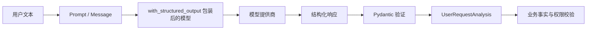
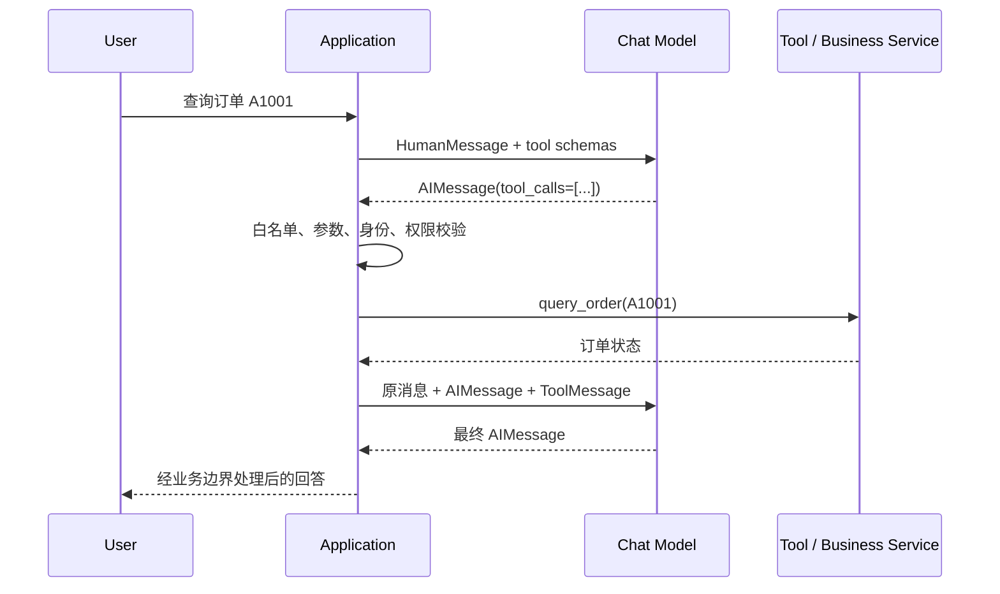

# 第 4 章：Structured Output、Pydantic、Tool Calling 与工具循环

> 本章状态：内容完成。验证日期：2026-09-05。关键依赖：LangChain 1.4.0、langchain-core 1.6.1、Pydantic 2.13.5、Python 3.12。

## 1. 本章解决的问题

第 3 章的链最终返回 `str`。文本适合展示，却不适合直接驱动程序：应用无法可靠判断其中哪个词是订单号、意图是否属于已知范围，也不能把“请查询订单”当成已经执行过查询。

本章解决两个相邻但不同的问题：

1. **Structured Output**：要求模型返回符合 Schema 的数据，再由 Pydantic 做运行时验证。
2. **Tool Calling**：让模型只能提出带名称和参数的工具请求，由应用决定是否以及怎样执行。

完成本章后，应当能够解释：

- `Literal`、`Field`、`field_validator` 各约束什么；
- `with_structured_output()` 为什么返回新的 Runnable；
- `@tool` 如何把函数签名和 docstring 变成工具 Schema；
- `bind_tools()` 只把工具说明交给模型，不会执行 Python 函数；
- `AIMessage.tool_calls`、`ToolMessage` 和 `tool_call_id` 如何构成协议；
- 为什么业务权限、参数校验和高风险操作必须由应用掌握。

本章手写一次最小工具循环。第 7 章再用 LangGraph 的 `ToolNode` 和路由消除手写循环的编排代码。

## 2. 背景与技术动机

### 2.1 自然语言不是稳定的程序接口

假设模型回答：

```text
用户大概想退款，订单可能是 A1001。
```

程序若用正则或字符串切割提取字段，会遇到措辞变化、字段缺失、多余解释和错误类型。更合理的边界是先声明数据合同：

```json
{
  "intent": "refund",
  "order_id": "A1001",
  "summary": "用户询问订单退款流程"
}
```

Schema 让字段名、类型、允许值和说明显式化。它提高了可解析性，但不保证内容真实：模型即使返回合法的 `order_id`，这个订单也可能不存在或不属于当前用户。

### 2.2 模型不能直接拥有业务能力

LLM 本身不会查询数据库，也没有资格取消订单。Tool Calling 的含义不是“模型执行函数”，而是模型输出一个结构化请求：

```text
请调用 query_order(order_id="A1001")
```

应用收到请求后，仍要完成工具白名单、身份与租户注入、参数验证、授权、超时和审计，然后才可能执行真实服务。模型负责选择和填写候选调用，应用拥有执行权。

## 3. 核心心智模型

### 3.1 Structured Output 是输出合同

本章定义：

```python
class UserRequestAnalysis(BaseModel):
    model_config = ConfigDict(extra="forbid")

    intent: Literal[
        "order_query", "refund", "complaint", "other"
    ] = Field(description="用户意图，只能选择一个已知分类")
    order_id: str | None = Field(
        default=None,
        description="用户明确提到的订单号，没有则为 null",
    )
    summary: str = Field(min_length=1, max_length=100)
```

这里的 `Literal[...]` 不是数组，而是类型约束：`intent` 只能等于四个字符串之一。`str | None` 表示字段值可以是字符串或 `None`。`Field` 提供默认值、长度和给模型看的字段说明。

Pydantic 验证的是**数据形状与局部规则**，例如允许值、类型、长度和空白处理。它不能确认订单真实存在，也不能确认用户有权访问它；这些属于业务服务。

### 3.2 `with_structured_output()` 包装模型

```python
structured_model = model.with_structured_output(
    UserRequestAnalysis
)
```

这行没有调用模型。它基于原模型创建一个新的 Runnable，在后续 `invoke()` 或 `ainvoke()` 时：

1. 将 Pydantic 模型转换成模型提供商可理解的 Schema；
2. 请求模型按 Schema 返回字段；
3. 解析提供商响应；
4. 用 Pydantic 验证；
5. 成功时返回 `UserRequestAnalysis`，失败时抛出解析或验证异常。

底层策略依赖模型提供商能力：有的支持原生结构化响应，有的通过 Tool Calling 实现。不能假设所有“OpenAI 兼容”服务都支持完全相同的方法、Schema 特性或 `tool_choice`。

### 3.3 Tool 是 Schema 与执行函数的组合

```python
@tool
def query_order(order_id: str) -> dict[str, str]:
    """查询一个订单的当前状态。"""
    ...
```

`@tool` 会把普通函数包装成 LangChain Tool：

- 函数名通常成为工具名；
- 参数类型生成 JSON Schema；
- docstring 成为描述，帮助模型判断何时调用；
- 函数体仍由应用进程执行。

工具描述过于含糊会造成错误选择；参数 Schema 过宽会增加危险输入。Schema 是给模型的能力说明，不是安全边界。

### 3.4 `bind_tools()` 只是绑定说明

```python
model_with_tools = model.bind_tools([query_order])
response = model_with_tools.invoke(messages)
```

`bind_tools()` 返回带工具定义的新模型 Runnable。第一次模型响应可能包含 `response.tool_calls`，但 Python 函数并未因此自动运行。直接使用 Chat Model 时，执行和回传由应用负责；使用 Agent 或后续的 `ToolNode` 时，框架可以代管循环编排，但安全策略仍由应用设计。

### 3.5 `tool_call_id` 是请求与结果的关联键

一次 `AIMessage` 可以提出多个工具调用。每个调用包含：

```python
{
    "name": "query_order",
    "args": {"order_id": "A1001"},
    "id": "call-order-001",
}
```

应用执行后用 `ToolMessage` 回传：

```python
ToolMessage(
    content='{"status": "shipped"}',
    tool_call_id="call-order-001",
    name="query_order",
)
```

`tool_call_id` 必须对应原请求的 `id`。它类似请求关联 ID，使模型能区分多个并行调用分别返回了什么；它不是订单号、trace ID 或幂等键。

## 4. 输入、输出与执行流程

Structured Output 是一次“模型输出到业务 DTO”的转换：



Tool Calling 是至少两次模型调用夹一次应用执行：



真实执行顺序是：

1. 应用保存用户 `HumanMessage`。
2. 带工具说明的模型决定直接回答还是返回 `tool_calls`。
3. 应用只从白名单选择工具，并校验模型生成的参数。
4. 应用注入可信身份和租户信息，再调用业务服务。
5. 每个执行结果包装成关联正确的 `ToolMessage`。
6. 应用把完整消息历史再次发给模型。
7. 模型根据工具返回值形成最终回答；如再次请求工具，循环还会继续。

## 5. 最小可运行示例

完整示例位于 [`examples/chapter04_structured_tools`](https://github.com/MIRS571/java-backend-to-agent/tree/main/examples/chapter04_structured_tools)。在仓库根目录运行：

```powershell
uv run python -m examples.chapter04_structured_tools.structured_output_demo
uv run python -m examples.chapter04_structured_tools.tool_loop_demo
```

第一个示例用固定字典验证 Pydantic 边界，因此不伪装成真实模型调用：

```python
analysis = UserRequestAnalysis.model_validate(
    {
        "intent": "refund",
        "order_id": " a1001 ",
        "summary": "用户询问订单退款流程",
    }
)
```

真实模型接入点则明确保留为：

```python
def create_structured_model(model: BaseChatModel):
    return model.with_structured_output(UserRequestAnalysis)
```

第二个示例固定构造一次 `AIMessage.tool_calls`，让离线测试专注于工具执行协议，而不是依赖网络或模型临场选择。核心循环是：

```python
request = fake_model_requests_tool()
messages.append(request)

tool_results = execute_requested_tools(request)
messages.extend(tool_results)

final_answer = fake_model_writes_final_answer(tool_results[0])
messages.append(final_answer)
```

这里的 Fake 只替换两次模型调用；`@tool` 包装、白名单查找、函数执行、`ToolMessage` 构造和消息顺序都是真实应用需要处理的协议。

## 6. 关键 API 解释

| API / 语法 | 接收什么 | 返回什么 / 副作用 | 关键边界 |
| --- | --- | --- | --- |
| `BaseModel` | 类型标注与字段配置 | 可验证、可序列化的对象 | DTO，不是数据库 Entity |
| `Literal["a", "b"]` | 固定字面量类型 | 限制字段允许值 | 不是 `list`，运行时由 Pydantic 验证 |
| `Field(...)` | 默认值、描述、长度等 | 字段元数据和验证规则 | `description` 不能代替代码约束 |
| `@field_validator(...)` | 一个或多个字段名 | 在模型创建时执行自定义验证 | 必须返回处理后的值 |
| `model_validate(dict)` | 未验证数据 | Pydantic 对象或 `ValidationError` | 只证明满足 Schema |
| `model_dump()` | Pydantic 对象 | 普通字典 | 适合进入 JSON/持久化边界前转换 |
| `with_structured_output(Schema)` | Pydantic、TypedDict 或 JSON Schema | 新的模型 Runnable | 定义时不调用网络 |
| `@tool` | Python 函数 | LangChain Tool | docstring 会影响模型的工具选择 |
| `bind_tools(tools)` | 工具列表与可选调用策略 | 绑定工具 Schema 的模型 Runnable | 不自动执行工具 |
| `AIMessage.tool_calls` | 模型响应中的调用请求 | 调用列表 | 参数来自不可信模型输出 |
| `tool.invoke(args)` | 已检查的调用参数 | 工具结果 | 可能产生网络、数据库或业务副作用 |
| `ToolMessage` | 工具结果与关联 ID | 发给模型的结果消息 | `tool_call_id` 必须匹配请求 |

`@classmethod` 与 `field_validator` 连用，是因为验证器由 Pydantic 在创建实例的过程中调用，不依赖某个已经存在的对象。`cls` 表示当前模型类；`value` 是待验证字段值；函数必须返回最终保存的值，或抛出 `ValueError`。

## 7. Java / Spring 类比

| Python / LangChain | Java / Spring 类比 | 类比的边界 |
| --- | --- | --- |
| Pydantic `BaseModel` | 带 Bean Validation 的请求/响应 DTO | Pydantic 在 Python 运行时解析和转换类型，规则并非完全对应 Jakarta Validation |
| `Literal[...]` | enum 允许值集合 | 它是类型标注，不会生成具备方法和状态的 Java `enum` 类 |
| `Field` | `@NotBlank`、`@Size` 加 OpenAPI 字段说明 | `description` 还可能被发给模型指导生成字段 |
| `field_validator` | 自定义 `ConstraintValidator` 或 DTO 规范化 | 它可以返回转换后的字段值，不是 Service 业务校验 |
| `with_structured_output` | HTTP Client 响应反序列化到 DTO | LLM 仍可能生成错误事实，且提供商实现策略不同 |
| `@tool` | 暴露给编排层的受控 Service 方法描述 | 不是让模型获得 Spring Bean 或数据库访问权限 |
| `tool_call_id` | RPC correlation ID | 只关联模型协议中的工具请求与结果，不负责全链路追踪 |
| 工具循环 | Controller/Orchestrator 调下游 Service 再组装响应 | 模型可能动态选择下一步，因此循环次数必须受限 |

在 Java 与 Python 分工中，Python Tool 可以调用 Java 内部 API，但 `user_id`、`tenant_id` 和权限不能让模型填写。它们应由认证后的请求上下文注入；Java 服务还要再次授权，不能只信任 Python。

## 8. Demo 与企业级写法

| 当前 Demo | 企业级实现必须补充 |
| --- | --- |
| 内存订单字典 | 调用受认证的 Java 业务 API 或 Repository Adapter |
| 固定模型工具请求 | 真实 `bind_tools()`、能力兼容测试和模型错误映射 |
| 单个只读工具 | 工具注册表、按角色/租户裁剪工具集、版本管理 |
| 参数直接进入工具 | Pydantic 参数模型、长度范围、格式和语义校验 |
| 固定一次工具调用 | 最大循环次数、超时、取消、并发和总成本预算 |
| 工具异常直接抛出 | 可重试分类、降级、对模型安全的错误消息和审计日志 |
| 查询无副作用 | 写操作的授权、幂等键、事务、人工审批和结果核验 |
| 全量结果发给模型 | 脱敏、字段最小化、内容长度限制和 Prompt Injection 防护 |

企业工具建议按风险分级：

- **只读工具**：查询订单、检索知识；仍需租户隔离和访问控制。
- **低风险写工具**：保存偏好、创建草稿；需要校验和幂等。
- **高风险工具**：退款、删除、支付；需要确定性规则、明确授权，通常还需要人工确认。

模型永远不能因为“它认为用户有权限”而获得权限。

## 9. 局限性与常见错误

### 9.1 Structured Output 不等于事实正确

Schema 合法只说明字段可被程序接收。订单号可能是模型编造的，分类也可能判断错误。业务层必须查询权威数据，并对重要判断设置评估与人工兜底。

### 9.2 把四个 `Literal` 值当作数组

`Literal["order_query", ...]` 是类型系统允许值，不是运行时拿来遍历的业务列表。需要展示枚举或维护映射时，应单独定义领域枚举或配置，避免把类型提示误当数据结构。

### 9.3 以为 `bind_tools()` 已经运行函数

模型只会返回工具调用意图。若没有执行器读取 `tool_calls`、调用函数并添加 `ToolMessage`，流程会停在请求阶段。手写模型循环时必须保留原 `AIMessage`，再追加对应的 `ToolMessage`。

### 9.4 `tool_call_id` 不匹配

并行或连续调用时，缺失或错误的关联 ID 会让模型无法判断某个结果属于哪个请求。不要用工具名或订单号替代调用 ID。

### 9.5 把模型参数当成可信上下文

如果 Tool Schema 暴露 `tenant_id`、`user_id` 或角色字段，模型可能生成另一个用户的值。身份信息必须从经过认证的 Runtime/请求上下文注入，不进入模型可控制的参数。第 8 章会进一步讲 Runtime。

### 9.6 直接暴露任意函数或 SQL 工具

通用 SQL、Shell、文件写入或内部管理接口会把模型错误和 Prompt Injection 放大成真实副作用。优先暴露窄而明确的领域工具，例如 `query_own_order(order_id)`，并在工具内部再次校验授权。

### 9.7 盲目强制 `tool_choice`

不同提供商、模型与推理模式对 Tool Calling 和 `tool_choice` 的支持不一致。出现“不支持 tool_choice”时，应检查模型能力和提供商文档，而不是不断修改 Prompt。只有业务确实要求调用时才强制；否则让模型选择或在应用工作流中确定性路由。

## 10. 本章总结

- Structured Output 用 Schema 把模型自由文本收敛为可验证对象。
- Pydantic 负责类型、允许值和字段级规则；业务真实性、权限和领域规则仍由 Service 负责。
- `with_structured_output()` 和 `bind_tools()` 都返回包装后的 Runnable，定义时不发起调用。
- Tool Calling 是“模型提出请求”，不是“模型执行函数”。
- 完整工具循环至少包含模型请求、应用执行、`ToolMessage` 回传和模型最终回答。
- `tool_call_id` 关联一次工具请求与结果；模型参数始终是不可信输入。
- 高风险工具必须增加授权、幂等、审计和人工审批，不能只依赖模型判断。

## 11. 思考题

1. 一个 `UserRequestAnalysis` 对象已经通过 Pydantic 校验，为什么仍不能直接据此执行退款？
2. `bind_tools([query_order])` 之后，Python 的 `query_order` 函数为什么还没有运行？谁应该拥有最终执行权？
3. 为什么身份与租户字段不应作为普通 Tool 参数暴露给模型？Java 服务是否还需要再次校验？
4. 一次 `AIMessage` 同时请求两个工具时，应用如何保证两个 `ToolMessage` 不被模型混淆？
5. 对查询订单、修改收货地址和执行退款三个工具，你会分别增加哪些不同的安全边界？

## 12. 官方参考资料与验证版本

官方资料：

- [LangChain：Models、Tool Calling 与 Structured Output](https://docs.langchain.com/oss/python/langchain/models)
- [LangChain：Tools](https://docs.langchain.com/oss/python/langchain/tools)
- [LangChain：Messages 与 ToolMessage](https://docs.langchain.com/oss/python/langchain/messages)
- [LangChain：Structured Output](https://docs.langchain.com/oss/python/langchain/structured-output)
- [LangChain：ChatOpenAI Tool Calling](https://docs.langchain.com/oss/python/integrations/chat/openai)
- [Pydantic：Models](https://docs.pydantic.dev/latest/concepts/models/)
- [Pydantic：Validators](https://docs.pydantic.dev/latest/concepts/validators/)
- [Pydantic：Fields](https://docs.pydantic.dev/latest/concepts/fields/)

资料于 2026-09-05 核对。示例使用 Python 3.12、LangChain 1.4.0、langchain-core 1.6.1、Pydantic 2.13.5。普通示例固定模型消息并离线运行，验证 Schema、工具包装、调用白名单、`ToolMessage` 关联和消息顺序；不验证真实模型提供商的 Tool Calling 能力、凭证、网络或费用。
