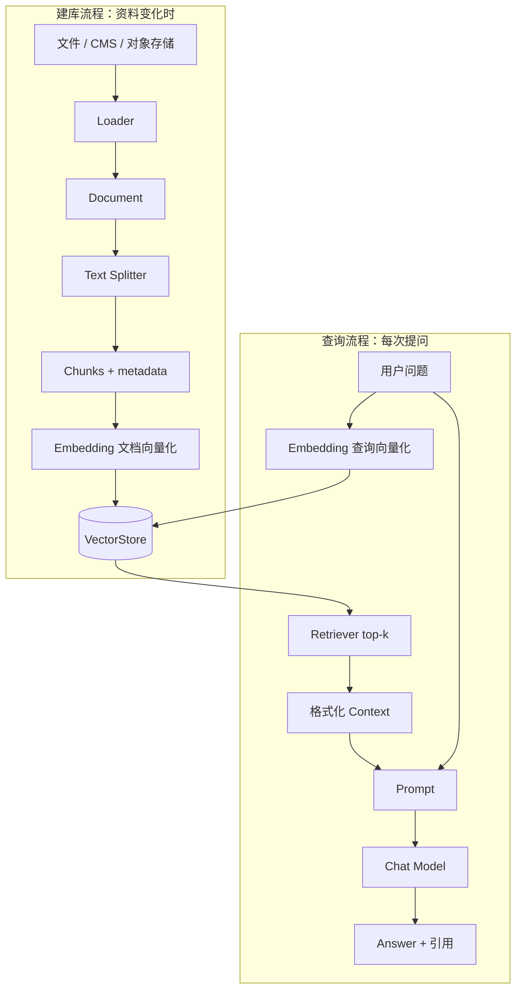

# 第 5 章：RAG、Document、切分、Embedding、向量检索与 Retriever

> 本章状态：内容完成。验证日期：2026-09-05。关键依赖：LangChain 1.4.0、langchain-core 1.6.1、langchain-text-splitters 1.1.2、NumPy 2.5.2、Python 3.12。

## 1. 本章解决的问题

LLM 的训练知识有截止时间，无法天然知道企业刚更新的退款政策、内部手册或租户私有资料。把全部文档塞进 Prompt 又会超过上下文限制、增加成本，并让无关内容干扰答案。

RAG（Retrieval-Augmented Generation，检索增强生成）采用另一条路径：先从外部知识库找出与问题相关的少量文档片段，再把这些片段作为上下文交给模型生成回答。

本章建立最小数据流：

```text
原始资料 -> Document -> Chunk -> Embedding -> VectorStore
用户问题 -> Embedding -> 相似度检索 -> Retriever -> Context -> LLM Answer
```

完成本章后，应当能够区分：

- `Document.page_content` 与 `Document.metadata`；
- 为什么切分太大、太小或没有 overlap 都会影响召回；
- Embedding 为什么必须对文档与问题使用兼容模型；
- VectorStore 与 Retriever 的职责差异；
- 检索成功为什么仍不等于最终回答正确；
- 建库流程为什么不应在每次聊天请求中重复执行。

本章只使用内存向量库理解机制。第 6 章再引入 Qdrant、稳定 ID、多租户过滤、引用与检索评估。

## 2. 背景与技术动机

### 2.1 RAG 修补的是知识输入，不是模型本身

RAG 不训练或修改模型参数。它在模型调用前动态提供外部文本，因此知识可以更新、删除和追溯。适合企业制度、产品说明、知识库和操作手册等文本知识。

RAG 不应替代所有数据访问：

- “退款政策是什么”适合检索文档；
- “订单 A1001 当前是否已发货”应调用订单系统；
- “执行退款”必须进入受授权、幂等的业务流程。

政策文本是非结构化知识，订单状态是实时结构化事实，退款是高风险动作。把三者全部塞入向量库会模糊数据所有权。

### 2.2 为什么不能每次把完整文档发给模型

完整文档会带来四类问题：

1. 上下文窗口有限，资料可能放不下；
2. Token 越多通常成本和延迟越高；
3. 无关内容会降低模型聚焦能力；
4. 无法清楚说明答案依据哪个片段。

检索的目标不是“找出所有文档”，而是在有限上下文预算内召回足以回答问题的证据。

## 3. 核心心智模型

### 3.1 RAG 有两条生命周期不同的流程

**建库（ingestion/indexing）流程**通常在资料新增或更新时运行：

```text
读取资料 -> 标准化 Document -> 切分 -> 计算文档向量 -> 写入向量库
```

**查询（retrieval/generation）流程**在每次用户提问时运行：

```text
问题 -> 计算查询向量 -> 检索 top-k Chunk -> 格式化 Context -> 模型生成
```

示例为了单文件易运行，会在 `retrieve()` 内临时建库。生产服务绝不能照搬：否则每个请求都重新加载和向量化全部资料，浪费时间与 Embedding 成本。

### 3.2 `Document` 是统一文本载体

```python
Document(
    page_content="已发货订单不能直接取消。",
    metadata={
        "source": "refund-policy.md",
        "section": "退款",
    },
)
```

- `page_content` 是要切分、向量化并可能发给模型的文本；
- `metadata` 是来源、章节、租户、版本、时间等结构化属性；
- `id` 可表示稳定文档或 Chunk 身份，第 6 章深入处理。

Metadata 不会自动成为安全条件。只有在检索查询中强制使用可信的租户过滤，它才真正参与隔离。

### 3.3 Chunk 是检索的基本单位

文档太长时，整篇只生成一个向量会把多个主题压在一起；检索后也会占用大量 Prompt。切得过小则容易丢失句子关系，例如只召回“不能直接取消”，却不知道说的是已发货订单。

`RecursiveCharacterTextSplitter` 按分隔符优先级递归切分，尽量保留段落、句子，再在必要时切到更小单位：

```python
splitter = RecursiveCharacterTextSplitter(
    chunk_size=32,
    chunk_overlap=6,
    add_start_index=True,
    separators=["\n\n", "\n", "。", "，", " ", ""],
)
```

- `chunk_size`：目标 Chunk 最大长度；默认长度函数按字符数计算；
- `chunk_overlap`：相邻 Chunk 重叠的目标长度，用来保留边界上下文；
- `add_start_index`：把 Chunk 在原文中的起始字符位置写入 metadata；
- `separators`：按顺序尝试切分，中文应考虑 `。`、`，` 等标点。

Overlap 不是越大越好。过大会产生重复召回、增加存储和上下文 Token，还可能让同一段证据挤占多个 top-k 名额。

### 3.4 Embedding 是数值表示，不是原文摘要

Embedding 模型把文本转换为固定维度的浮点向量：

```text
"已发货订单怎么退款" -> [0.0, 0.71, 0.71, ...]
```

语义相近的文本应在向量空间中距离较近。向量库用余弦相似度、点积或欧氏距离等方法进行近邻搜索。

文档向量和问题向量必须来自相同或明确兼容的 Embedding 模型，并保持相同维度与归一化约定。更换模型通常意味着重新建立索引，不能把新查询向量直接拿去搜索旧模型生成的文档向量。

本章 `LocalKeywordEmbeddings` 只按少量关键词生成 6 维向量，用来获得稳定离线测试。它不会理解真正语义，因此不是可部署的 Embedding 模型。

### 3.5 VectorStore 存储并搜索，Retriever 统一查询接口

`InMemoryVectorStore` 保存 Chunk、metadata 和向量，并执行相似度搜索：

```python
store = InMemoryVectorStore(embedding=embeddings)
store.add_documents(chunks)
```

Retriever 是更窄的抽象：输入查询字符串，输出 `list[Document]`。

```python
retriever = store.as_retriever(search_kwargs={"k": 2})
documents = retriever.invoke(question)
```

VectorStore 还负责写入、删除、按向量搜索和返回分数；Retriever 只向上层暴露“根据查询取回文档”的接口。这样 RAG 链不必绑定某个数据库实现。

## 4. 输入、输出与执行流程



查询阶段按真实执行顺序展开：

1. Retriever 接收普通字符串问题。
2. VectorStore 使用同一个 Embedding 对象生成查询向量。
3. 向量库计算近邻并选择 top-k Chunk。
4. Retriever 返回 `list[Document]`，通常不包含相似度分数。
5. 应用把 `page_content` 与来源标签格式化为受控字符串。
6. Prompt 同时接收 `context` 和原始 `question`。
7. 模型根据资料回答；资料不足时应该明确拒答。
8. 应用保留来源 metadata，供前端展示和审计。

## 5. 最小可运行示例

完整代码位于 [`examples/chapter05_rag_basics`](https://github.com/MIRS571/java-backend-to-agent/tree/main/examples/chapter05_rag_basics)。在仓库根目录运行：

```powershell
uv run python -m examples.chapter05_rag_basics.rag_demo
```

示例的数据准备链路：

```python
documents = load_documents()
chunks = split_documents(documents)
store = InMemoryVectorStore(
    embedding=LocalKeywordEmbeddings()
)
store.add_documents(chunks)
retriever = store.as_retriever(search_kwargs={"k": 2})
```

在线查询链路：

```python
documents = retriever.invoke(question)
context = format_documents(documents)
messages = build_rag_prompt().invoke(
    {"context": context, "question": question}
).to_messages()
```

`format_documents()` 明确将 `Document` 变成 Prompt 需要的字符串：

```python
def format_documents(documents: list[Document]) -> str:
    blocks = []
    for index, document in enumerate(documents, start=1):
        source = document.metadata["source"]
        blocks.append(
            f"[{index}] source={source}\n{document.page_content}"
        )
    return "\n\n".join(blocks)
```

`enumerate(..., start=1)` 同时取得从 1 开始的编号和文档对象；f-string 把编号、来源和正文格式化；`"\n\n".join(blocks)` 用空行连接多个片段。Retriever 返回的是对象列表，Prompt 需要的是文本，因此这个转换边界不能省略。

最终生成环节使用确定性函数替代真实 LLM，只为证明检索结果能进入答案和引用。它不能验证自然语言生成质量。

## 6. 关键 API 解释

| API / 对象 | 接收什么 | 返回什么 / 副作用 | 关键边界 |
| --- | --- | --- | --- |
| `Document(...)` | `page_content`、metadata、可选 id | 标准文档对象 | metadata 不会自动做权限过滤 |
| `split_documents(docs)` | `list[Document]` | 继承 metadata 的 Chunk 列表 | 切分会改变检索粒度 |
| `embed_documents(texts)` | 多个文本 | `list[list[float]]` | 用于批量建库，可能产生模型费用 |
| `embed_query(text)` | 一个问题 | `list[float]` | 必须与文档向量兼容 |
| `InMemoryVectorStore(...)` | Embedding 实现 | 进程内 VectorStore | 重启丢失，不适合生产共享 |
| `add_documents(chunks)` | Document 列表 | 写入并返回 ID | 会执行文档 Embedding |
| `similarity_search(query, k)` | 查询和数量 | Document 列表 | 不直接返回相似度分数 |
| `similarity_search_with_score(...)` | 查询和数量 | `(Document, score)` 列表 | 分数含义与数据库/距离策略相关 |
| `as_retriever(...)` | 搜索类型和参数 | Retriever | 不复制数据，只包装搜索接口 |
| `retriever.invoke(query)` | 查询字符串 | `list[Document]` | 它检索，不生成答案 |

`k=2` 表示最多取回两个结果，不表示相似度至少为 2，也不保证两个结果都相关。是否需要 score threshold、MMR、混合检索或 reranker，要由评估数据决定。

## 7. Java / Spring 类比

| RAG 概念 | Java / Spring 类比 | 类比的边界 |
| --- | --- | --- |
| `Document` | 带正文和属性的传输对象 | 它不是 JPA Entity，也不代表权威业务事实 |
| Loader | 文件/CMS 的 Adapter | 不应把解析、切分和在线问答混在 Controller |
| Text Splitter | 文档预处理 Service | 切分质量直接影响语义召回，不只是字符串分页 |
| Embeddings | 批量特征编码 Client | 输出是向量，不是文本摘要或加密结果 |
| VectorStore | 面向向量近邻查询的 Repository | 查询语义与传统 SQL 精确过滤不同 |
| Retriever | `KnowledgeRepository` 接口 | 只约定 query -> Documents，不负责生成答案 |
| 2-step RAG | Service 先查 Repository，再调下游生成服务 | LLM 输出仍然不具备事务确定性 |

在企业架构中，可以让 Java 管理知识源、权限和发布流程，让 Python 负责切分、Embedding、检索与生成。无论由哪一侧建库，都必须为文档版本、租户和删除传播定义清楚的数据合同。

## 8. Demo 与企业级写法

| 当前 Demo | 企业级 RAG 应补充 |
| --- | --- |
| 代码中构造 `Document` | Loader、格式解析、清洗、文档版本与失败重试 |
| 字符级固定切分 | 按文档结构和 Token 预算切分，并通过评估调参 |
| 关键词教学向量 | 经领域语料评估的多语言 Embedding 模型 |
| 每次查询临时建库 | 独立增量 ingestion 流程，查询服务只读取索引 |
| `InMemoryVectorStore` | Qdrant 等持久化、可扩展向量数据库 |
| 只设置 `k` | score threshold、metadata filter、MMR 或 reranker |
| Prompt 中标来源 | 稳定 Chunk ID、原文 URL/版本和可验证引用映射 |
| 单租户资料 | 在数据库查询阶段强制 tenant filter |
| 固定答案函数 | 真实模型、资料不足拒答、评估和防注入策略 |

Embedding 模型不是按“参数越大越好”选择。需要考虑中文和领域语义、维度、延迟、部署方式、成本以及检索评估结果。模型首次下载较慢只说明文件尚未缓存，不代表程序卡死；生产部署应提前构建镜像或缓存模型，而不是让首个用户请求触发下载。

## 9. 局限性与常见错误

### 9.1 把检索当成关键词匹配

真实 Embedding 检索依据向量相似度，可以召回没有相同字面的语义近邻。本章教学 Embedding 恰好使用关键词，只为离线可重复，不能由此推断生产语义效果。

### 9.2 文档与问题使用不同 Embedding 模型

不同模型的向量维度或空间含义通常不同。更换模型后应建立新索引并进行回归评估，而不是在旧 Collection 上混写。

### 9.3 每次请求重新 `add_documents()`

这会重复生成向量、写入重复数据并增加延迟。建库是独立生命周期；在线查询只做 query Embedding 和检索。

### 9.4 只调 `k`，不做评估

`k` 太小可能漏证据，太大会引入噪声并消耗上下文。正确值依赖 Chunk 策略、Embedding、语料和问题类型，需要用标注查询集测 Recall@k 等指标。第 6 章实现最小评估。

### 9.5 认为相似度最高就一定正确

向量相似度只表示在当前模型空间中接近，不证明文档权威、最新或足以回答。检索结果还要考虑版本、权限、来源质量和时间。

### 9.6 忽略 metadata 和稳定来源

只存正文会让引用、更新和删除变得困难。至少保留来源、版本、章节和稳定标识；多租户系统还必须在检索时过滤租户。

### 9.7 把检索资料当成系统指令

知识库文本是不可信内容，可能包含恶意指令。Prompt 应明确资料仅用于提供事实，工具权限不能因检索文本而改变；敏感操作仍由确定性授权控制。

### 9.8 把 Retriever 输出直接当最终回答

Retriever 返回 `Document`，不负责组织自然语言、判断资料是否充分或生成引用。RAG 的 Generation 阶段仍需 Prompt 与模型，或者由应用直接展示检索结果。

## 10. 本章总结

- RAG 在推理时检索外部知识，不修改模型参数。
- 建库和在线查询是生命周期不同的两条流程，生产中必须分离。
- `Document` 用 `page_content` 保存正文，用 metadata 保存来源等属性。
- Chunk 大小和 overlap 决定检索粒度，需要用实际评估调整。
- Embedding 把文本映射到向量；文档与查询必须使用兼容模型。
- VectorStore 负责向量存储和搜索；Retriever 提供统一的 query -> Documents 接口。
- 检索结果要格式化后才能进入 Prompt；模型回答仍可能错误。
- RAG 适合知识，不替代实时业务查询、权限判断和高风险动作。

## 11. 思考题

1. 为什么生产服务不应该在每次用户提问时重新加载、切分并向量化全部文档？
2. 如果退款条件的前半句和后半句被切进两个 Chunk，可能造成什么检索问题？`chunk_overlap` 能解决全部问题吗？
3. Retriever 已经返回两个最相似的 Document，为什么应用仍不能保证模型答案正确？
4. “查询订单当前状态”和“解释退款政策”分别应该使用 Tool Calling 还是 RAG？说明数据所有权。
5. 更换 Embedding 模型时，为什么通常需要重建索引？如何判断新模型真的更好？

## 12. 官方参考资料与验证版本

官方资料：

- [LangChain：Retrieval 与 RAG 架构](https://docs.langchain.com/oss/python/langchain/retrieval)
- [LangChain：构建语义搜索知识库](https://docs.langchain.com/oss/python/langchain/knowledge-base)
- [LangChain：Text Splitter 集成](https://docs.langchain.com/oss/python/integrations/splitters)
- [LangChain：RecursiveCharacterTextSplitter](https://docs.langchain.com/oss/python/integrations/splitters/recursive_text_splitter)
- [LangChain Reference：InMemoryVectorStore](https://reference.langchain.com/python/langchain-core/vectorstores/in_memory/InMemoryVectorStore)
- [LangChain：Retriever 集成与接口](https://docs.langchain.com/oss/python/integrations/retrievers/index)

资料于 2026-09-05 核对。示例使用 Python 3.12、LangChain 1.4.0、langchain-core 1.6.1、langchain-text-splitters 1.1.2 和 NumPy 2.5.2。离线测试验证 Document、中文递归切分、metadata 继承、向量维度与归一化、Retriever、Context 格式和最小 RAG 数据流；不验证生产 Embedding 质量、持久化向量数据库、租户过滤、真实模型生成或检索评估。
