# 第 6 章：Qdrant、稳定 ID、多租户过滤、引用与检索评估

> 本章状态：内容完成。验证日期：2026-09-07。关键依赖：LangChain 1.4.0、langchain-qdrant 1.1.0、qdrant-client 1.19.0、Qdrant Server 1.18.2、Python 3.12。

## 1. 本章解决的问题

第 5 章使用 `InMemoryVectorStore` 解释 RAG 数据流，但进程退出后数据消失，也没有解决重复写入、租户隔离、引用追溯和质量评估。企业 RAG 不能只做到“搜出几段看起来相关的文本”，还必须回答：

- 向量、正文和 metadata 存在哪里？
- 同一批知识重复同步时，如何避免产生重复 Chunk？
- 两个租户有相似政策时，如何保证绝不串数据？
- 回答中的来源怎样映射回确切文档版本？
- 修改 `k`、切分或 Embedding 后，怎样判断检索真的变好？

本章用 Qdrant 建立一条可测试的企业级最小链路：

```text
Document + stable ID + tenant metadata
                ↓
       Qdrant Point / Payload
                ↓
query + mandatory tenant Filter
                ↓
Document + citation metadata
                ↓
          Recall@k evaluation
```

本章不会把单节点 Docker Compose 描述成生产集群。它只是可选的本地开发环境；自动测试使用 Qdrant `:memory:` 模式，不要求启动容器。

## 2. 背景与技术动机

### 2.1 为什么从内存向量库迁移到 Qdrant

生产检索需要多个进程共享数据、服务重启后保留索引、按 metadata 过滤并管理 Point。Qdrant 是专门的向量搜索服务，可以保存向量以及 JSON-like Payload，并在向量搜索中组合过滤条件。

引入向量数据库不是因为 RAG “必须使用某个品牌”，而是因为数据生命周期已经超出单个 Python 进程。若数据量很小且现有数据库的向量扩展足够，也可以选择其他实现；上层应尽量依赖 Retriever 接口，而不是让业务代码到处调用 Qdrant Client。

### 2.2 企业 RAG 的正确性先于相似度

如果跨租户文档与问题更相似，它可能排在第一名。先全局检索再用 Python 删除其他租户结果会造成：

- 数据已经越过隔离边界；
- top-k 名额可能被其他租户占满，过滤后没有结果；
- 日志、trace 或中间对象可能泄露不该读取的内容。

因此，可信 `tenant_id` 必须成为 Qdrant 查询的 Filter，由数据库在候选检索阶段执行。相似度排序只能在允许访问的数据集合内发生。

## 3. 核心心智模型

### 3.1 Qdrant 的四个核心名词

| Qdrant 名词 | 本章对应内容 | 作用 |
| --- | --- | --- |
| Collection | `support_knowledge` | 一组向量配置相同的 Point，类似索引边界 |
| Point | 一个 Chunk | 包含唯一 ID、向量和 Payload |
| Vector | 6 维教学向量 | 用于近邻相似度搜索 |
| Payload | 正文和 metadata | 用于还原 Document、过滤、引用和管理 |

Collection 不等于关系数据库的一张普通表。它还固定向量名称、维度与距离策略。同一个 dense vector 配置下，写入向量的维度必须一致。

### 3.2 为什么要显式创建 Collection

```python
if not client.collection_exists(collection_name=COLLECTION_NAME):
    client.create_collection(
        collection_name=COLLECTION_NAME,
        vectors_config=VectorParams(
            size=VECTOR_SIZE,
            distance=Distance.COSINE,
        ),
    )
```

这段代码依次做三件事：

1. 查询 Collection 是否存在；
2. 不存在时创建，避免无条件创建导致冲突；
3. 声明向量为 6 维，并使用 Cosine 距离。

`size` 必须等于 Embedding 输出维度。本章教学 Embedding 是 6 维；换成生产模型时必须读取该模型的真实维度并建立匹配的 Collection。`Distance.COSINE` 是搜索度量，不是 Embedding 配置；它必须与模型评估和向量归一化策略匹配。

`QdrantVectorStore` 随后连接已有 Collection：

```python
vector_store = QdrantVectorStore(
    client=client,
    collection_name=COLLECTION_NAME,
    embedding=LocalKeywordEmbeddings(),
)
```

构造 VectorStore 不会自动写入业务文档。它只是把 Qdrant Client、Collection 与 Embedding 适配成 LangChain VectorStore。

### 3.3 稳定 Chunk ID 让重复同步变成 upsert

若每次 `add_documents()` 都生成随机 UUID，同一个 Chunk 重复同步会产生多份 Point。检索结果可能被重复文本占满，删除和版本更新也难以定位。

本章用逻辑身份生成 UUID v5：

```python
identity = "|".join(
    [tenant_id, source, version, str(start_index)]
)
chunk_id = str(uuid5(CHUNK_NAMESPACE, identity))
```

相同逻辑身份总是得到相同 ID，因此再次写入会覆盖同一 Point，而不是新增重复项。ID 中包含租户，避免不同租户的同名文档冲突；包含来源、版本和起始位置，能区分不同版本和 Chunk。

这不是唯一正确算法。生产中还要明确：文档内容更新时版本由谁递增、旧版本何时删除、切分策略变化是否建立新索引。稳定 ID 解决“怎样定位”，不自动解决数据同步生命周期。

### 3.4 LangChain metadata 在 Qdrant Payload 中是嵌套的

`QdrantVectorStore` 默认保存类似结构：

```json
{
  "page_content": "已发货订单不能直接取消……",
  "metadata": {
    "tenant_id": "company_001",
    "source": "refund-policy.md",
    "version": "2026-09",
    "chunk_id": "..."
  }
}
```

因此过滤路径必须写成 `metadata.tenant_id`：

```python
Filter(
    must=[
        FieldCondition(
            key="metadata.tenant_id",
            match=MatchValue(value=tenant_id),
        )
    ]
)
```

若直接用 `tenant_id`，路径与实际 Payload 不一致，通常会得到空结果。若项目自定义了 `metadata_payload_key`，过滤路径也要同步改变。

### 3.5 Retriever 中的 Filter 必须来自可信上下文

```python
retriever = vector_store.as_retriever(
    search_kwargs={
        "k": k,
        "filter": tenant_filter(tenant_id),
    }
)
```

`tenant_id` 不能来自用户问题或模型生成结果。它应来自认证后的 HTTP/JWT 上下文，并由应用注入。第 8～10 章会把这种可信上下文放入 Runtime、FastAPI 依赖和服务边界。

Filter 不是可选优化，而是数据访问条件。生产 Collection 还应为高频过滤字段创建 Payload Index；多租户场景可把 tenant 字段标记为 `is_tenant=true`，以帮助 Qdrant 优化同租户数据布局。

### 3.6 引用是结构化来源，不是一段模型文字

检索后生成独立引用对象：

```python
@dataclass(frozen=True)
class Citation:
    chunk_id: str
    source: str
    version: str
```

模型可以在答案中写 `[1]`，但后端必须保留编号到 `Citation` 的确定性映射。只有模型声称“来源是某文件”不能视为可靠引用，因为模型可能写错文件名或编号。

稳定引用至少应包含 Chunk ID、文档来源和版本。真实系统通常还需要标题、可访问 URL、页码/章节、发布时间以及用户是否有权打开原文。

### 3.7 Recall@k 评估的是检索阶段

本章评估用例包含问题、租户和预期来源：

```python
EvaluationCase(
    question="质量问题退货运费谁承担？",
    tenant_id="company_001",
    expected_source="shipping-policy.md",
)
```

若预期来源出现在 top-k 中，该问题记为一次 hit：

```text
Recall@k = 命中预期来源的问题数 / 总问题数
```

Recall@k 只评价“证据有没有被召回”，不评价排序位置、无关结果数量、最终答案正确性或引用忠实性。企业 RAG 应把检索评估和生成评估分开，否则无法判断问题出在 Retriever 还是 LLM。

## 4. 输入、输出与执行流程

```mermaid
flowchart TB
    subgraph Ingestion[独立建库流程]
        Source[已发布知识文档] --> Split[切分与 metadata]
        Split --> ID[生成 stable chunk_id]
        ID --> Embed[文档 Embedding]
        Embed --> Upsert[Qdrant upsert Point]
    end

    subgraph Query[在线查询流程]
        Auth[认证上下文] --> Tenant[可信 tenant_id]
        Question[用户问题] --> QueryVector[查询 Embedding]
        Tenant --> Filter[metadata.tenant_id Filter]
        QueryVector --> Search[Qdrant filtered search]
        Filter --> Search
        Search --> Docs[Document 列表]
        Docs --> Context[Prompt Context]
        Docs --> Citations[Citation 列表]
        Context --> Model[Chat Model]
        Model --> Answer[Answer]
        Answer --> Response[Answer + Citations]
        Citations --> Response
    end
```



写入阶段真实执行顺序：

1. 准备带 `tenant_id`、`source`、`version`、`start_index` 的 Chunk。
2. 根据逻辑身份生成稳定 UUID。
3. 将 `chunk_id` 同时设置为 Point ID 和 metadata 字段。
4. `add_documents(documents=..., ids=...)` 调用 Embedding。
5. LangChain 把向量、正文和 metadata 写入 Qdrant。
6. 相同 ID 再次写入时更新 Point；不增加数量。

查询阶段：

1. 上层认证系统提供可信租户。
2. 应用构造 `metadata.tenant_id` Filter。
3. Qdrant 只在满足 Filter 的 Point 中进行向量搜索。
4. Retriever 返回 Document；metadata 保留来源身份。
5. 应用分别构造 Prompt Context 和 Citation 列表。
6. 模型生成回答；API 响应返回答案和结构化引用。

## 5. 最小可运行示例

完整示例位于 [`examples/chapter06_enterprise_rag`](https://github.com/MIRS571/java-backend-to-agent/tree/main/examples/chapter06_enterprise_rag)。在仓库根目录运行：

```powershell
uv run python -m examples.chapter06_enterprise_rag.qdrant_demo
```

输出会展示 Point 数量、只属于 `company_001` 的检索结果、结构化 Citation 与 `Recall@1`。Qdrant 使用内存模式：

```python
client = QdrantClient(location=":memory:")
```

它执行真实的 Qdrant Client、Collection、Point、Payload 和 Filter 逻辑，但不会启动服务器，也不会创建数据库文件。进程结束后数据消失，所以只适合示例与单元测试。

可选 Docker 开发环境位于 [`infra/qdrant/compose.yml`](https://github.com/MIRS571/java-backend-to-agent/blob/main/infra/qdrant/compose.yml)。需要时从仓库根目录运行：

```powershell
docker compose -f infra/qdrant/compose.yml up -d
docker compose -f infra/qdrant/compose.yml ps
docker compose -f infra/qdrant/compose.yml down
```

Compose 使用命名 Volume `qdrant-data`。这个 Volume 由 Docker 创建并管理，不是仓库中的 `data` 文件夹；`down` 默认不删除它，只有显式使用 `down -v` 才会删除 Volume 中的数据。

本课程不会自动启动或删除容器。开发 Compose 只绑定 `127.0.0.1`，因为默认 Qdrant 没有认证，不应暴露到公网。

## 6. 关键 API 与配置解释

| API / 配置 | 输入 | 输出或副作用 | 必须记住的边界 |
| --- | --- | --- | --- |
| `QdrantClient(location=":memory:")` | 内存位置 | 本地嵌入式 Client | 测试用，退出即丢数据 |
| `QdrantClient(url=...)` | 服务 URL、可选认证 | 远程 Client | Client 是连接入口，不是 Collection |
| `collection_exists()` | Collection 名 | `bool` | 只检查，不创建 |
| `create_collection()` | 名称、向量参数 | 创建 Collection | `size` 必须匹配 Embedding 维度 |
| `VectorParams` | `size`、`distance` | 向量字段配置 | Collection 创建后不能随意更换模型 |
| `QdrantVectorStore(...)` | Client、Collection、Embedding | LangChain VectorStore | 构造时不等于写入全部文档 |
| `add_documents(..., ids=...)` | Document 与 Point ID | Embedding + upsert | 稳定 ID 避免重复 Point |
| `client.count(...).count` | Collection 与精确选项 | Point 数量 | 用于观测，不证明内容都正确 |
| `Filter(must=[...])` | AND 条件列表 | 查询过滤表达式 | 租户隔离必须在查询内执行 |
| `FieldCondition` | Payload key 与匹配规则 | 一个字段条件 | key 要匹配实际嵌套路径 |
| `MatchValue` | 精确值 | keyword 等值匹配 | 不负责相似度 |
| `as_retriever(search_kwargs=...)` | `k`、Filter 等 | Retriever | 将固定安全条件封装进查询入口 |
| `client.close()` | 无 | 释放 Client 资源 | 服务中通常由 lifespan 统一管理 |

配置项看起来多，是因为它们属于不同层，不应一次死记：

```text
连接层：QdrantClient(url / location / api_key)
索引层：collection_name + VectorParams(size / distance)
适配层：QdrantVectorStore(client / collection / embedding)
写入层：documents + ids
查询层：question + k + filter
```

先判断代码处在哪一层，再查看该对象的构造签名和官方文档，比背诵全部参数可靠。

## 7. Java / Spring 类比

| Qdrant / RAG | Java / Spring 类比 | 类比的边界 |
| --- | --- | --- |
| `QdrantClient` | Elasticsearch/Redis 的 Client Bean | 它连接向量服务，不拥有业务事务 |
| Collection | 搜索索引 | 不完全等同 MySQL 表，包含向量维度与距离配置 |
| Point | 带 ID 的索引文档 | Payload 可过滤，但不是权威领域 Entity |
| Payload | JSON 文档字段 | LangChain 默认将 metadata 嵌套在 `metadata` 下 |
| stable Chunk ID | 确定性业务键 | 切分策略和版本生命周期仍需额外设计 |
| `Filter.must` | SQL `WHERE ... AND ...` | 向量检索仍是近邻搜索，不是精确关系查询 |
| Payload Index | 数据库二级索引 | 针对过滤字段，不是向量 HNSW 索引本身 |
| Retriever | `KnowledgeRepository` | 应封装强制租户过滤，而非让 Controller 随意传空 |
| `client.close()` | 销毁 Client Bean | Python 中由 context manager/lifespan 管理更自然 |

Java 网关可以传递经过签名或内部网络认证的租户上下文，但 Python 必须验证来源。更重要的是，Qdrant Filter 与 Java 业务 API 的授权要分别执行；检索权限不能推导出退款操作权限。

## 8. Demo 与企业级写法

| 当前 Demo | 企业级实现需要补充 |
| --- | --- |
| Qdrant `:memory:` | 远程服务/集群、持久化、容量规划和备份恢复 |
| 单节点开发 Compose | TLS、认证、网络策略、高可用、监控和滚动升级 |
| 6 维关键词向量 | 版本化的真实 Embedding 模型与批量建库 |
| 四个固定 Chunk | 增量同步、删除传播、失败重试和死信处理 |
| UUID v5 逻辑 ID | 文档/Chunk 版本规范和切分策略版本 |
| 每次构造 Filter | 封装不可绕过的 tenant-aware Repository |
| 无 Payload Index | 为 tenant、source、version 等过滤字段建索引 |
| `k=1` 和两个问题 | 代表性标注集、多组参数和持续回归 |
| Recall@k | Precision、MRR/NDCG、答案正确性与引用忠实性 |
| 简单 Citation | 原文访问授权、可用 URL、页码和版本校验 |

多租户并非总要“每租户一个 Collection”。大量小租户通常可共享 Collection 并使用 tenant Payload Filter；少量高隔离或超大租户可以考虑独立 Collection、用户定义 Shard 或分层多租户。选择要基于租户数量、隔离等级、容量与运维成本。

## 9. 局限性与常见错误

### 9.1 先检索再在 Python 中按租户过滤

这是安全错误，不是性能小问题。Filter 必须随查询发送给 Qdrant，并且来自可信身份上下文。

### 9.2 过滤字段路径写错

LangChain 默认结构下应使用 `metadata.tenant_id`。字段路径不匹配可能返回空结果。先查看实际 Payload，再定义 Filter 和 Payload Index。

### 9.3 使用随机 ID 重复导入

随机 ID 会让相同 Chunk 反复增加。应定义稳定身份，并在同步时处理新增、更新与删除。仅依赖内容哈希也有局限：内容不变但权限或来源版本变化时，生命周期仍需业务规则。

### 9.4 向量维度与 Collection 不匹配

Embedding 输出维度必须等于 `VectorParams.size`。更换模型时建议建立版本化新 Collection、完成回填与评估后再切流量。

### 9.5 把 Qdrant 的默认端口直接暴露公网

默认本地启动不代表带认证。开发环境只绑定回环地址；生产必须使用认证、TLS、网络访问控制与最小权限。

### 9.6 把 Docker Compose 当成生产高可用方案

单节点 Compose 适合学习和本机开发，不能提供跨节点容灾。生产要考虑官方托管服务或受支持的集群部署、备份恢复和监控。

### 9.7 只看 100% Recall 就宣布 RAG 完成

两个固定问题得到 100% 没有统计意义。评估集必须覆盖真实措辞、拒答、相似政策、版本冲突和多租户边界；还要单独评价最终答案与引用。

### 9.8 让模型自行生成 Citation 数据

模型可以决定怎样表达答案，但 `chunk_id`、source 和 version 应由后端从 Retriever 返回的 metadata 构造。否则引用可能无法打开或指向错误版本。

## 10. 本章总结

- Qdrant 用 Collection 管理同一向量配置的 Point；Point 包含 ID、Vector 与 Payload。
- `QdrantVectorStore` 是 LangChain 适配层，不替代 Qdrant Client 或安全设计。
- 稳定 Chunk ID 使重复建库可以 upsert，并支持更新、删除和引用定位。
- LangChain 默认把 metadata 嵌套在 Payload 的 `metadata` 下，租户路径是 `metadata.tenant_id`。
- 多租户 Filter 必须在 Qdrant 查询中执行，并由可信认证上下文注入。
- Citation 应由应用从 metadata 确定性构造，而不是相信模型自由生成。
- Recall@k 只评价检索召回；生成质量、引用忠实性和安全边界需要独立测试。
- Docker Compose 是本地开发工具，不是自动部署或生产高可用方案。

## 11. 思考题

1. 为什么先全局取 top-3，再在 Python 中删掉其他租户的结果，既不安全也可能降低召回？
2. 稳定 Chunk ID 中为什么要包含 tenant、source、version 和位置？切分规则变化时还缺少什么信息？
3. `metadata.tenant_id` 与 `tenant_id` 的区别来自哪里？怎样确认一个现有 Collection 应使用哪条路径？
4. Recall@3 达到 100% 时，为什么仍不能证明最终回答和引用正确？还应该分别测什么？
5. 在“共享 Collection + Filter”和“每租户独立 Collection”之间，你会根据哪些业务与运维条件选择？

## 12. 官方参考资料与验证版本

官方资料：

- [LangChain：Qdrant 集成、Payload 与 Metadata Filter](https://docs.langchain.com/oss/python/integrations/vectorstores/qdrant)
- [Qdrant：本地 Docker Quickstart](https://qdrant.tech/documentation/quick-start/)
- [Qdrant：Payload](https://qdrant.tech/documentation/concepts/payload/)
- [Qdrant：Filtering](https://qdrant.tech/documentation/search/filtering/)
- [Qdrant：Multitenancy](https://qdrant.tech/documentation/manage-data/multitenancy/)
- [Qdrant：多租户分区策略](https://qdrant.tech/documentation/tutorials/multiple-partitions/)
- [Qdrant：安装与生产部署边界](https://qdrant.tech/documentation/installation/)
- [Qdrant：自托管安全](https://qdrant.tech/documentation/tutorials-operations/secure-qdrant/)
- [Qdrant Server Releases](https://github.com/qdrant/qdrant/releases)

资料于 2026-09-07 核对。示例使用 Python 3.12、LangChain 1.4.0、langchain-qdrant 1.1.0、qdrant-client 1.19.0；Docker 开发模板固定 Qdrant Server 1.18.2。离线测试验证 Collection、稳定 UUID、幂等 upsert、嵌套 metadata Filter、跨租户隔离、Citation 和 Recall@k；不验证远程 Qdrant 网络、认证、持久化、集群、高可用、生产 Embedding 或真实模型生成质量。
