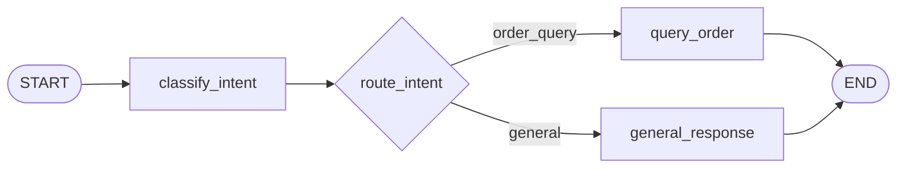
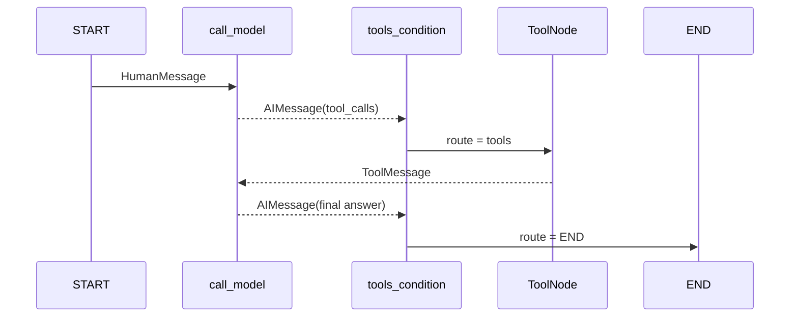

# 第 7 章：LangGraph State、Node、Edge、路由、MessagesState 与 ToolNode

> 本章状态：内容完成。验证日期：2026-09-07。关键依赖：LangGraph 1.2.11、LangChain 1.4.0、langchain-core 1.6.1、Python 3.12。

## 1. 本章解决的问题

第 4 章手写了工具循环，第 5～6 章建立了检索流程。当应用继续增加意图判断、RAG、工具、人工审批和错误分支时，用一层层 `if/else` 与 `while` 把所有步骤塞进同一个 Service，会产生三个问题：

- 当前数据状态分散在局部变量和消息列表中；
- 下一步为什么执行不容易观察和测试；
- 暂停、恢复、持久化和流式事件缺少统一边界。

LangGraph 用显式图描述有状态工作流。本章只建立最小心智模型：

```text
State 保存当前快照
Node 读取 State 并返回局部更新
Edge 决定下一个 Node
compile() 生成可执行 Graph
invoke() 用初始 State 启动一次运行
```

完成本章后，应当能够解释：

- `TypedDict` State 描述了什么，运行时又发生了什么；
- Node 为什么返回 `dict` 局部更新；
- 普通 Edge 与 Conditional Edge 的区别；
- `START`、`END` 和 `compile()` 的作用；
- Reducer 如何决定覆盖还是合并；
- `MessagesState` 为什么能不断追加 Message；
- `ToolNode` 与 `tools_condition` 怎样代替手写工具分发循环。

本章不加入 Checkpointer、Memory、Runtime、Interrupt 或 Resume，它们属于第 8 章。

## 2. 背景与技术动机

### 2.1 LangChain Chain 与 LangGraph 的边界

线性流程适合 LCEL：

```text
Prompt -> Model -> Parser
```

一旦流程需要分支和循环：

```text
模型 -> 有工具调用？ -> 执行工具 -> 再次调用模型
                 └-> 没有 -> 结束
```

图结构更容易表达“当前在哪个节点、为什么走这条边、哪些数据被更新”。LangGraph 不是替代 LangChain：Node 内仍然可以使用 Chat Model、Prompt、Retriever 和 Tool；LangGraph负责工作流状态与控制流。

### 2.2 图并不会自动变成 Agent

Node 可以调用 LLM，也可以只是普通 Python 函数。条件路由可以由模型决定，也可以由确定性业务规则决定。使用 LangGraph 只说明工作流被表示为图，不代表系统已经拥有自主规划能力。

企业应用反而应把能确定的部分写成确定性 Edge，例如权限失败、参数缺失和高风险审批；不要为了“更智能”让模型决定所有路线。

## 3. 核心心智模型

### 3.1 State 是一次运行的共享数据快照

```python
class SupportState(TypedDict, total=False):
    question: str
    intent: Literal["order_query", "general"]
    answer: str
    path: Annotated[list[str], operator.add]
```

`TypedDict` 是类型描述：它告诉编辑器、类型检查器和 LangGraph，State 字典应有哪些 key 以及值类型。它不是通过 `SupportState()` 创建的 Java Bean，也不会仅凭类型标注完成所有运行时业务校验。

`total=False` 表示构造局部字典时不要求一次提供全部 key。Graph 初始输入可以先有 `question` 和 `path`，后续 Node 再补充 `intent` 与 `answer`。

State 不应存放数据库连接、模型 Client 或 Service 实例。它需要可序列化，才能在后续章节保存 checkpoint；依赖资源和可信请求上下文应放 Runtime。

### 3.2 Node 读取完整快照，返回局部更新

```python
def classify_intent(state: SupportState) -> dict[str, object]:
    intent = (
        "order_query"
        if "订单" in state["question"]
        else "general"
    )
    return {
        "intent": intent,
        "path": ["classify_intent"],
    }
```

执行 Node 时：

1. LangGraph 将当前 State 快照传入 `state`；
2. 函数读取需要的字段；
3. 函数执行模型、检索或普通代码；
4. 函数返回 State 的局部更新；
5. LangGraph 根据每个字段的 Reducer 合并更新。

Node 不必返回整个 State。未出现在返回字典中的字段不会自动删除。应把 Node 写成职责明确的函数，避免在多个 Node 中原地修改同一个可变对象。

### 3.3 默认更新是覆盖，Reducer 可以改为合并

普通字段没有 Reducer 时，新值覆盖旧值：

```text
answer: "旧值" + update "新值" -> "新值"
```

本章给 `path` 声明 `operator.add`：

```python
path: Annotated[list[str], operator.add]
```

因此两个 Node 分别返回：

```python
{"path": ["classify_intent"]}
{"path": ["query_order"]}
```

最终得到：

```python
["classify_intent", "query_order"]
```

`Annotated` 在这里不是创建数组，而是在 `list[str]` 类型旁附加 Reducer 元数据。Reducer 的签名可以理解为 `(旧值, 新值) -> 合并值`。

Reducer 设计不当会造成重复、覆盖或并行写冲突，不能把所有列表都机械地设置为相加。

### 3.4 Edge 只负责控制流

固定下一步使用普通 Edge：

```python
builder.add_edge(START, "classify_intent")
builder.add_edge("query_order", END)
```

动态选择使用条件 Edge：

```python
builder.add_conditional_edges(
    "classify_intent",
    route_intent,
)
```

路由函数读取 Node 更新后的 State，并返回下一个 Node 名：

```python
def route_intent(
    state: SupportState,
) -> Literal["query_order", "general_response"]:
    if state["intent"] == "order_query":
        return "query_order"
    return "general_response"
```

路由函数通常不做业务副作用，只做选择。若需要在同一步同时更新 State 和跳转，可以在更复杂场景使用 `Command`，但本章不引入第二种写法。

### 3.5 不要从同一 Node 混用固定与条件路由

假设已经存在：

```python
builder.add_conditional_edges("call_model", tools_condition)
```

再添加：

```python
builder.add_edge("call_model", END)
```

含义不是“如果不调用工具就结束”，而是给同一个 Node 又增加一条无条件路径。Graph 可能同时调度条件目标和 `END`，使行为难以推断；某些图结构或更新冲突会进一步报错。

正确的结束条件已经由 `tools_condition` 负责：有 `tool_calls` 返回 `"tools"`，没有则返回 `END`。对一个 Node 选择一种清晰的路由机制。

### 3.6 `START` 和 `END` 是虚拟节点

- `START` 不执行业务函数，它把初始输入送到入口 Node；
- `END` 不生成答案，它表示该路径不再调度后续 Node。

```python
builder.add_edge(START, "classify_intent")
builder.add_edge("general_response", END)
```

真正的最终结果是 Graph 停止时的 State，而不是 `END` 返回的对象。

### 3.7 `StateGraph` 是构建器，编译后才能运行

```python
builder = StateGraph(SupportState)
# 然后添加 add_node / add_edge / add_conditional_edges
graph = builder.compile()
```

`compile()` 检查和整理图结构，生成 `CompiledStateGraph`。可执行的是 `graph`，它实现 Runnable 接口，可以使用 `invoke`、`ainvoke`、`stream` 和 `astream`。

```python
result = graph.invoke(
    {"question": "查询订单 A1001", "path": []}
)
```

传入字典是初始 State，不是“规范最终输出”的 Schema。返回值是运行结束后的 State 快照。本章输出与输入使用同一个 State Schema；LangGraph 也支持单独的 input/output schema，但不是这里这行代码自动产生的。

### 3.8 `MessagesState` 是带消息 Reducer 的预置 State

聊天与工具循环都需要不断追加 Message。若普通字段使用默认覆盖，每个 Node 返回一条消息就会丢失历史。`MessagesState` 已定义 `messages` 字段并使用 `add_messages` Reducer。

```python
builder = StateGraph(MessagesState)
```

Node 仍只返回新增消息：

```python
return {"messages": [AIMessage(content="...")]}
```

LangGraph 会把它合并到已有消息。`add_messages` 不只是简单 `list + list`：新 ID 会追加；相同 Message ID 会替换旧对象；字典形式输入还会被反序列化为对应的 LangChain Message。

因此下面两种输入都可以进入消息图：

```python
{"messages": [HumanMessage(content="你好")]}
```

```python
{"messages": [{"role": "user", "content": "你好"}]}
```

Node 内读取时得到 Message 对象，应使用 `message.content`，而不是继续假设它是普通字典。

### 3.9 `ToolNode` 执行工具，`tools_condition` 判断路线

```python
builder.add_node("tools", ToolNode([query_order]))
builder.add_conditional_edges("call_model", tools_condition)
builder.add_edge("tools", "call_model")
```

`tools_condition` 检查最后一条 `AIMessage`：

- 存在 `tool_calls`：路由到名为 `tools` 的 Node；
- 不存在：路由到 `END`。

`ToolNode` 读取调用名称、参数和 ID，匹配已注册工具，执行后把结果包装为 `ToolMessage`。接着固定 Edge 返回 `call_model`，让模型读取工具结果并决定最终回答或再次调用工具。

`ToolNode` 代替了第 4 章手写的分发和 `ToolMessage` 构造，但不会自动提供权限、幂等、租户隔离或人工审批。工具安全边界依然存在。

## 4. 输入、输出与执行流程

### 4.1 普通条件路由图



调用订单问题时，State 演化如下：

```text
初始：{question, path=[]}
  ↓ classify_intent 返回 {intent, path=[classify_intent]}
合并：{question, intent=order_query, path=[classify_intent]}
  ↓ route_intent 选择 query_order
  ↓ query_order 返回 {answer, path=[query_order]}
最终：{question, intent, answer,
       path=[classify_intent, query_order]}
```

### 4.2 Message 与 ToolNode 循环



最终 `messages` 按顺序包含：

1. `HumanMessage`：用户问题；
2. `AIMessage`：模型提出工具调用；
3. `ToolMessage`：工具执行结果；
4. `AIMessage`：模型根据结果形成最终回答。

## 5. 最小可运行示例

完整示例位于 [`examples/chapter07_langgraph_basics`](https://github.com/MIRS571/java-backend-to-agent/tree/main/examples/chapter07_langgraph_basics)。在仓库根目录运行：

```powershell
uv run python -m examples.chapter07_langgraph_basics.routing_graph
uv run python -m examples.chapter07_langgraph_basics.message_tool_graph
```

第一个示例观察 State 和条件路由：

```python
builder = StateGraph(SupportState)
builder.add_node("classify_intent", classify_intent)
builder.add_node("query_order", query_order)
builder.add_node("general_response", general_response)
builder.add_edge(START, "classify_intent")
builder.add_conditional_edges("classify_intent", route_intent)
builder.add_edge("query_order", END)
builder.add_edge("general_response", END)
graph = builder.compile()
```

第二个示例把第 4 章工具循环改写为图：

```python
builder = StateGraph(MessagesState)
builder.add_node("call_model", call_model)
builder.add_node("tools", ToolNode([query_order]))
builder.add_edge(START, "call_model")
builder.add_conditional_edges("call_model", tools_condition)
builder.add_edge("tools", "call_model")
graph = builder.compile()
```

`call_model` 使用确定性代码模拟真实模型的两次响应，所以测试不需要 API Key、网络或费用。替换为真实模型时，图结构不变，Node 内部改为调用 `model_with_tools.invoke(state["messages"])`。

## 6. 关键 API 解释

| API / 语法 | 接收什么 | 返回什么 / 何时发生 | 关键边界 |
| --- | --- | --- | --- |
| `TypedDict` | 字段名和类型 | State Schema | 主要是类型结构，不自动保证业务正确 |
| `Annotated[T, reducer]` | 值类型与 Reducer | 字段合并策略 | 不等于普通集合声明 |
| `StateGraph(State)` | State Schema | Graph Builder | Builder 不能直接执行 |
| `add_node(name, func)` | 节点名与函数 | 注册 Node | Node 通常是 `State -> Partial<State>` |
| `add_edge(a, b)` | 起点和终点 | 固定控制流 | 同一起点可触发多个目标 |
| `add_conditional_edges()` | Node 与路由函数 | 动态控制流 | 路由函数返回 Node 名或映射 key |
| `START` | 无业务输入函数 | 虚拟入口 | 将初始 State 发送给首个 Node |
| `END` | 无业务输出函数 | 虚拟终点 | 最终输出是停止时 State |
| `compile()` | 已定义的 Builder | `CompiledStateGraph` | 编译后才可 invoke |
| `graph.invoke(input)` | 初始 State | 最终 State | 同步运行完整图 |
| `MessagesState` | `messages` | 预置消息 State | 使用 `add_messages` Reducer |
| `add_messages(old, new)` | 两组 Message | 合并后的列表 | 同 ID 更新，不只会追加 |
| `ToolNode(tools)` | 已注册工具 | 可执行 Node | 不自动设计授权策略 |
| `tools_condition` | 当前 MessagesState | `"tools"` 或 `END` 路线 | 根据最后一条 AIMessage 判断 |

## 7. Java / Spring 类比

| LangGraph | Java / Spring 类比 | 类比的边界 |
| --- | --- | --- |
| State | 一次工作流实例的 Context DTO | 不是共享 Singleton，也不应放 Client Bean |
| Node | 一个 Application Service 步骤 | 输入输出通过 State 更新协作，而非任意互调 |
| Edge | 流程引擎的 Transition | 不是 HTTP 路由或 Spring MVC Mapping |
| Conditional Edge | 根据 Context 选择下一状态 | 可以由普通代码或模型判断，需控制不确定性 |
| Reducer | 合并旧值与新事件的策略 | 不等于数据库事务或集合线程安全保证 |
| `compile()` | 构建并校验工作流定义 | 不会启动 Web Server 或立即执行模型 |
| Compiled Graph | 可调用的工作流 Service | 仍需由 FastAPI 生命周期管理其依赖 |
| `MessagesState` | 带消息聚合规则的会话 DTO | 不是持久化会话；未配置 Checkpointer 就不会跨调用记忆 |
| `ToolNode` | 通用 Tool Dispatcher | 不替代 Spring Security、事务、幂等或领域 Service |

最重要的类比边界：LangGraph State 属于一次 Graph 运行或线程状态，不是 Spring 中所有请求共享的可变 Bean。

## 8. Demo 与企业级写法

| 当前 Demo | 企业级 LangGraph 应补充 |
| --- | --- |
| 关键词确定性分类 | Structured Output 或确定性规则，并做分类评估 |
| 内存初始 State | 请求 DTO 映射、输入校验和可信上下文注入 |
| 同步 `invoke` | FastAPI 中使用 `ainvoke`/`astream` 和取消传播 |
| 无 Checkpointer | PostgreSQL Checkpointer、thread_id 和生命周期管理 |
| 无 Runtime | 注入 RAG Service、Client 与认证后上下文 |
| 单工具只读循环 | 工具权限、超时、重试、错误映射、幂等和审批 |
| 无限理论循环 | recursion limit、最大工具次数和成本预算 |
| 无观测 | Node 延迟、路径、模型用量、错误和 trace ID |
| State 字段较少 | 明确 input/internal/output schema 和敏感字段脱敏 |

Graph 应表达稳定的业务流程，不应把所有业务逻辑都搬进 State。关系型订单事实继续由 Java/数据库拥有；State 保存本次编排需要的引用、决策和中间结果。

## 9. 局限性与常见错误

### 9.1 把 `MessagesState` 当成自动记忆

它只定义当前 State 中消息怎样合并。未配置 Checkpointer 时，第二次独立 `invoke()` 不会自动拿到第一次消息。持久化和 `thread_id` 属于第 8 章。

### 9.2 Node 原地修改 State 后返回整个对象

这会让更新来源和 Reducer 行为难以判断。优先读取 State，返回最小局部更新；可变对象尤其要避免跨 Node 隐式共享修改。

### 9.3 列表字段没有 Reducer

默认更新通常覆盖旧值。需要累积路径或消息时应显式选择 Reducer；但累积并非总是正确，输出字段可能就应该覆盖。

### 9.4 同一 Node 同时连固定 END 与条件工具边

无条件 Edge 不会充当 `else`。已有 `tools_condition` 时，再从 `call_model` 连接 `END` 可能造成两条路径同时被调度。结束逻辑应由条件路由统一决定。

### 9.5 把路由函数写成重业务 Node

路由函数应根据已存在 State 做选择。网络调用、数据库写入和复杂副作用放在可观察、可重试的 Node 中，否则失败边界不清晰。

### 9.6 以为 `ToolNode` 自动保证安全

它负责协议执行，不知道当前用户能否退款。高风险工具必须继续使用身份、授权、参数验证、幂等和人工审批。

### 9.7 循环没有上限

模型可能反复请求工具。生产运行要设置 recursion limit、调用次数、超时和成本预算，并为耗尽情况定义明确错误。

### 9.8 把 Service 或数据库连接放进 State

State 需要可序列化以便 checkpoint。连接对象和依赖应由 Runtime 或应用生命周期持有，State 只保留 ID 与数据。

## 10. 本章总结

- LangGraph 用 State、Node 和 Edge 描述有状态工作流；Node 做事，Edge 选择下一步。
- State 是共享快照；Node 读取完整 State，返回局部更新。
- 无 Reducer 的字段通常覆盖；`Annotated` 可以为字段声明合并策略。
- 普通 Edge 表示固定跳转，Conditional Edge 表示运行时路由。
- `START` 与 `END` 是虚拟边界；`StateGraph` 必须 `compile()` 后才能调用。
- `MessagesState` 使用 `add_messages` 合并消息，但本身不提供跨调用持久化。
- `ToolNode` 执行工具协议，`tools_condition` 根据模型是否请求工具选择继续或结束。
- 不要从同一个 Node 混用无条件终止边和条件工具路由。
- Graph 编排不会替代权限、事务、幂等、租户隔离和资源生命周期。

## 11. 思考题

1. Node 为什么通常只返回 State 的局部更新？如果每个 Node 都原地修改并返回整个 State，会带来什么问题？
2. `path: Annotated[list[str], operator.add]` 中，`list[str]` 与 `operator.add` 分别负责什么？
3. 为什么在已有 `add_conditional_edges("call_model", tools_condition)` 时，不应再添加 `add_edge("call_model", END)`？
4. `MessagesState` 最终有四条消息，分别是谁产生的？哪一步真正执行了 Python 工具？
5. 为什么数据库 Client 不应放入 State？下一章应该用什么机制提供依赖并保存会话状态？

## 12. 官方参考资料与验证版本

官方资料：

- [LangGraph：Graph API Overview](https://docs.langchain.com/oss/python/langgraph/graph-api)
- [LangGraph：Use the Graph API](https://docs.langchain.com/oss/python/langgraph/use-graph-api)
- [LangGraph：Quickstart](https://docs.langchain.com/oss/python/langgraph/quickstart)
- [LangChain：ToolNode 与 tools_condition](https://docs.langchain.com/oss/python/langchain/tools)
- [LangGraph Reference：Graph、StateGraph、MessagesState](https://reference.langchain.com/python/langgraph/graph)
- [LangGraph Reference：StateGraph.compile](https://reference.langchain.com/python/langgraph/graph/state/StateGraph/compile)

资料于 2026-09-07 核对。示例使用 Python 3.12、LangGraph 1.2.11、LangChain 1.4.0 和 langchain-core 1.6.1。离线测试验证条件分支、Reducer、编译图调用、字典消息反序列化、Message 合并、`ToolNode` 工具协议和 `tool_call_id`；不验证真实模型、Checkpointer、Runtime、Interrupt、跨调用记忆、异步流式服务或生产工具安全策略。
