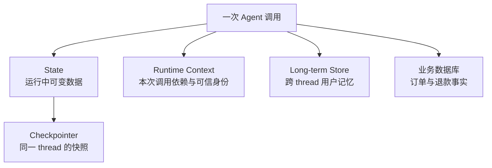
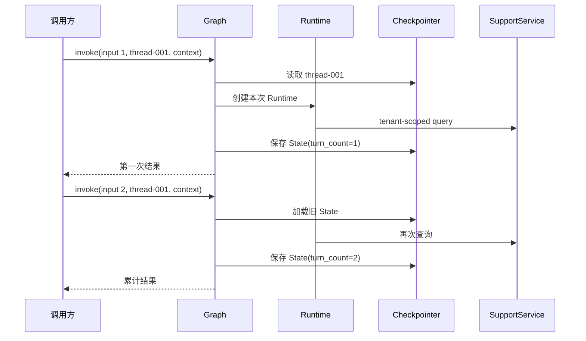
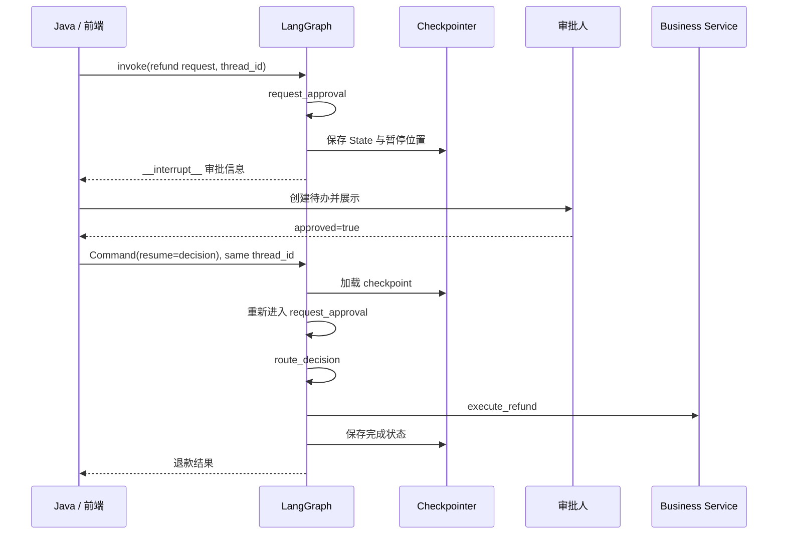

# 第 8 章：Checkpointer、Memory、Runtime、Interrupt 与 Resume

> 本章状态：内容完成。验证日期：2026-09-07。关键依赖：LangGraph 1.2.11、LangChain 1.4.0、Python 3.12。

## 1. 本章解决的问题

第 7 章的 Graph 每次都从输入重新开始。真实 Agent 服务还需要回答三个问题：

1. 同一个会话第二次请求时，怎样读取上一次运行留下的状态？
2. 数据库 Client、RAG Service 和可信 `tenant_id` 不适合写进 State，节点从哪里获得它们？
3. 退款、删除和发布等高风险动作，怎样暂停并等待人工决定，而不是让模型直接执行？

本章建立一条完整执行链：

```text
compile(checkpointer)
  -> invoke(input, thread_id, context)
  -> Node 通过 Runtime 读取依赖
  -> 每一步 State 写入 checkpoint
  -> interrupt(payload) 暂停
  -> 外部人员作出决定
  -> Command(resume=value) + 相同 thread_id
  -> 从 checkpoint 恢复并继续
```

这里有四类容易混为一谈的数据：

| 数据 | 例子 | 应放在哪里 |
| --- | --- | --- |
| 工作流可变状态 | messages、当前意图、审批结果 | LangGraph State，由 Checkpointer 保存 |
| 单次调用可信上下文与依赖 | tenant_id、Service、模型 Client | `Runtime[AgentContext]` |
| 跨会话长期记忆 | 用户偏好、长期画像 | LangGraph Store 或独立持久化系统 |
| 业务事实 | 订单、退款记录、权限 | Java 领域服务与关系数据库 |

完成本章后，应能准确解释：Checkpointer 保存什么，`thread_id` 为什么不可缺少，Runtime 为什么不是另一个 State，以及 `interrupt()` 暂停后如何恢复。

## 2. 背景与技术动机

### 2.1 为什么只有 `MessagesState` 还不够

`MessagesState` 定义了同一次 State 更新时消息怎样合并，但它不负责跨调用保存数据。若 Graph 没有 Checkpointer：

```python
graph.invoke({"messages": [第一条消息]})
graph.invoke({"messages": [第二条消息]})
```

第二次调用不会自动获得第一次的 State。要形成线程级短期记忆，需要在编译时传入 Checkpointer，并在调用时给出稳定的 `thread_id`。

### 2.2 为什么不能把所有对象都塞进 State

Checkpoint 需要序列化 State。字符串、数字、列表、字典和 LangChain Message 通常可以保存；数据库连接、HTTP Client、锁和 Service 实例则具有生命周期、连接池或进程边界，不应作为会话数据持久化。

因此需要分离：

- **State**：本次工作流会变化、需要恢复的数据；
- **Runtime Context**：执行节点所需但不应进入 State 的可信信息与依赖。

### 2.3 为什么人工审批必须是可恢复的暂停

HTTP 请求不能为了等待审批一直挂起数小时。更合理的方式是：保存当前状态、结束本次请求、把待审批信息交给外部系统；审批完成后，另一个请求用相同线程标识恢复流程。

这不是 Python 的 `input()`，也不是阻塞线程的 `sleep()`。`interrupt()` 表达的是一个持久化工作流暂停点。

## 3. 核心心智模型

### 3.1 Checkpointer 保存线程级 State 快照

```python
checkpointer = InMemorySaver()
graph = builder.compile(checkpointer=checkpointer)
```

Graph 每完成一个 super-step，就可以把 State、下一节点和相关元数据交给 Checkpointer。调用时必须提供：

```python
config = {
    "configurable": {
        "thread_id": "thread-001",
    }
}
```

`thread_id` 是 checkpoint 的稳定定位键：

- 相同 `thread_id`：加载并继续同一条线程的累计 State；
- 不同 `thread_id`：建立相互隔离的线程；
- 恢复 interrupt：必须再次使用暂停时的 `thread_id`。

它应当对应后端生成的会话 ID，而不是直接相信用户随意提交的值。多租户系统还需要在访问线程前校验“该会话是否属于当前认证主体”。

### 3.2 Checkpoint 是短期线程记忆，不是所有 Memory

在 Agent 语境中，“记忆”至少可能指四件不同的事：



Checkpointer 适合保存消息、流程位置和中间结果。它不应替代：

- Qdrant 中的知识向量；
- Redis 中的短时缓存、限流计数或分布式协调；
- MySQL/PostgreSQL 中的订单与交易记录；
- 跨多个 thread 共享的长期用户记忆。

LangGraph 的 Store 接口用于跨 thread 的长期记忆。本章只解释边界，不引入 Store 示例，以免把线程恢复与用户画像混成一个问题。

### 3.3 `AgentContext` 定义 Runtime Context 的结构

```python
@dataclass(frozen=True)
class AgentContext:
    tenant_id: str
    support_service: FakeSupportService
```

`@dataclass` 自动生成初始化等基础方法；`frozen=True` 阻止代码随意重新赋值字段，表达“本次调用上下文在运行期间保持稳定”的设计意图。它不是安全机制，真正的 `tenant_id` 仍必须来自认证后的服务端上下文。

`frozen=True` 也不会把字段引用的 Service 变成不可变对象。本章 Fake Service 仍会记录调用；冻结的是 Context 的字段绑定，而不是递归冻结整个对象图。

构建 Graph 时声明类型：

```python
builder = StateGraph(
    ConversationState,
    context_schema=AgentContext,
)
```

调用时提供具体对象：

```python
graph.invoke(
    input_state,
    config=config,
    context=AgentContext(
        tenant_id="company_001",
        support_service=service,
    ),
)
```

`context_schema` 说明“Runtime Context 应是什么结构”；`context=` 才是这一次运行实际传入的对象。前者类似方法签名中的类型契约，后者类似真正的实参。

### 3.4 `Runtime[AgentContext]` 是框架注入的调用期访问对象

节点可以声明第二个参数：

```python
def answer_order(
    state: ConversationState,
    runtime: Runtime[AgentContext],
) -> dict[str, object]:
    tenant_id = runtime.context.tenant_id
    service = runtime.context.support_service
```

执行节点时，LangGraph 根据函数签名注入当前调用的 `Runtime`。`Runtime[AgentContext]` 的含义是：“这是一个 Runtime，其 `context` 按 `AgentContext` 类型理解。”方括号不是创建对象，也不是数组。

Runtime 除了 `context`，还可以提供 Store、流式 writer 和执行信息。但本章只使用 `runtime.context`，因为一次只引入一个稳定心智模型。

为什么需要 Runtime，而不直接增加第三个普通参数？因为 Node 的调用由 LangGraph 调度，不是业务代码手动执行。框架需要一个约定好的入口，把当前运行的上下文、Store 和流式能力传给 Node。

### 3.5 Runtime、Checkpointer 与 FastAPI lifespan 的关系

三者处在不同层：

| 概念 | 何时创建/使用 | 负责什么 |
| --- | --- | --- |
| FastAPI `lifespan` | 应用进程启动与关闭时 | 创建和释放连接池、Client、Graph 等长期资源 |
| LangGraph Runtime | 每次 Graph 调用和节点执行时 | 把本次调用的 Context、Store 等交给节点 |
| Checkpointer | Graph 每个步骤及恢复时 | 保存和读取线程 State 快照 |

典型生产流程是：FastAPI `lifespan` 创建数据库连接和已编译 Graph；请求到达后，认证信息与这些 Service 被组装成 `AgentContext`；`ainvoke()`/`astream()` 创建本次 Runtime；节点通过 Runtime 使用依赖。Runtime 不负责启动 Uvicorn，也不负责创建或关闭数据库连接。

### 3.6 `interrupt()` 暂停并暴露可序列化信息

```python
decision = interrupt(
    {
        "type": "refund_approval",
        "order_id": state["order_id"],
        "amount": state["amount"],
        "question": "是否批准这笔退款？",
    }
)
```

第一次执行到这里时，`interrupt()` 不会立即产生普通返回值。LangGraph 捕获内部暂停信号，Checkpointer 保存当前位置，并把 payload 暴露给调用方。默认 v1 调用结果中可通过保留字段读取：

```python
interrupts = paused_result.get("__interrupt__", ())
```

这行是普通字典安全读取：

- 存在 `"__interrupt__"` 时得到其中的 interrupt 集合；
- 不存在时得到空元组 `()`；
- 它不会创建暂停，也不会从数据库主动查询。

payload 应只包含 JSON 可序列化的审批信息，不要放 Service、异常对象或密钥。
恢复值属于外部输入，仍需验证类型与权限。示例明确要求 `approved` 是 `bool`，避免把字符串 `"false"` 经过 `bool("false")` 错误转换为 `True`。

### 3.7 `Command(resume=...)` 将外部决定送回暂停点

```python
resumed_result = graph.invoke(
    Command(resume={"approved": True}),
    config=same_config,
    context=context,
)
```

恢复时：

1. Checkpointer 根据相同 `thread_id` 找到暂停状态；
2. 暂停所在 Node 从函数开头重新执行；
3. 再次到达同一个 `interrupt()` 时，`resume` 值成为它的返回值；
4. Node 生成 `approved` 更新；
5. 条件 Edge 选择执行或拒绝路径。

`Command(resume=...)` 是恢复 interrupt 的控制命令，不是 Graph 最终输出 Schema。普通新一轮对话仍应传入 State 字典，而不是滥用 `Command(update=...)`。

### 3.8 恢复会重新执行整个 Node

这是最重要的限制。恢复不是从 Python 函数的下一行继续，而是重新运行包含 `interrupt()` 的 Node：

```python
def approval_node(state):
    write_database()       # 恢复时可能再次执行：危险
    decision = interrupt(...)
    return {"approved": decision}
```

因此：

- 把退款等不可重复副作用放在 interrupt 之后的独立 Node；
- interrupt 之前若必须写入外部系统，要使用幂等键；
- 不要用普通 `try/except` 吞掉 interrupt 的内部暂停信号；
- 不要随意改变同一 Node 内多个 interrupt 的顺序。

本章示例使用 `request_approval -> execute_refund` 两个节点，使真正退款只可能在审批完成后发生。

## 4. 输入、输出与执行流程

### 4.1 同一线程的跨调用 State



第二次调用传入的是局部新输入。LangGraph 先加载已有 State，再按照字段 Reducer 合并输入，然后执行节点。示例中 `history` 使用 `operator.add` 累积，`turn_count` 使用默认覆盖。

### 4.2 人工审批的暂停与恢复



暂停和恢复通常是两个独立 HTTP 请求。生产系统还应在恢复接口校验审批人身份、审批权限、请求归属和当前业务状态。

## 5. 最小可运行示例

完整代码位于 [`examples/chapter08_persistence_interrupts`](https://github.com/MIRS571/java-backend-to-agent/tree/main/examples/chapter08_persistence_interrupts)。在仓库根目录运行：

```powershell
uv run python -m examples.chapter08_persistence_interrupts.checkpoint_runtime_demo
uv run python -m examples.chapter08_persistence_interrupts.interrupt_resume_demo
```

第一个示例验证：

```text
thread-001 第一次 -> turn_count = 1
thread-001 第二次 -> turn_count = 2
thread-002 第一次 -> turn_count = 1
```

第二个示例验证：暂停时退款 Service 调用次数为 0；批准并恢复后为 1。所有逻辑都是确定性的，不需要模型、网络、数据库或 API Key。

## 6. 关键 API 解释

| API / 语法 | 接收什么 | 返回什么 / 何时发生 | 关键边界 |
| --- | --- | --- | --- |
| `InMemorySaver()` | 无必填参数 | 进程内 Checkpointer | 进程结束即丢失，不适合生产 |
| `compile(checkpointer=...)` | Graph Builder 与 Saver | 可持久化的 Compiled Graph | 只配置能力，不会立即保存 State |
| `configurable.thread_id` | 稳定线程 ID | Checkpoint 定位信息 | 恢复必须使用相同值，并校验归属 |
| `graph.get_state(config)` | 含 thread_id 的配置 | 当前 `StateSnapshot` | `snapshot.values` 才是 State 值 |
| `context_schema=AgentContext` | Context 类型 | Graph 的运行时上下文契约 | 不创建具体 Context 对象 |
| `context=context` | 本次调用的对象 | 进入 Runtime | 不应直接接受未认证的租户信息 |
| `Runtime[AgentContext]` | 框架注入 | 当前运行的访问对象 | 泛型标注不是数组或对象构造 |
| `runtime.context` | 无额外输入 | 本次调用 Context | 不属于 checkpointed State |
| `interrupt(payload)` | JSON 可序列化值 | 首次暂停；恢复时返回 resume 值 | 所在 Node 恢复时从头执行 |
| `result.get("__interrupt__", ())` | key 与默认值 | v1 结果中的暂停集合或空元组 | 只是读取结果，不触发暂停 |
| `Command(resume=value)` | 人工/外部输入 | 恢复控制命令 | 必须配合同一 thread_id 与 Checkpointer |

## 7. Java / Spring 类比

| LangGraph | Java / Spring 类比 | 类比边界 |
| --- | --- | --- |
| State | 工作流实例的可持久化 Context DTO | 不是共享 Singleton，也不是完整业务实体 |
| Checkpointer | 工作流引擎的实例快照仓库 | 不等同于 JPA Repository 或业务数据库 |
| `thread_id` | 流程实例 ID / 会话 ID | 仅有 ID 不代表调用者有访问权限 |
| `AgentContext` | 一次 Service 调用所需依赖与可信请求上下文 | 不是 Spring ApplicationContext |
| `Runtime[AgentContext]` | 框架提供的 Invocation Context | LangGraph 按 Node 签名注入，不是 Spring Bean 自动装配 |
| FastAPI lifespan | Spring Bean 初始化/销毁阶段 | 实际进程模型与容器能力不同 |
| `interrupt()` | 持久化工作流的人工作业节点 | 不是线程阻塞、断点或控制台输入 |
| `Command(resume=...)` | 完成待办后推进流程实例 | 不能绕过权限与业务状态复核 |

`AgentContext` 这个名字容易让 Java 开发者联想到 Spring `ApplicationContext`，但两者不是一回事。这里它只是课程定义的一个小型数据类，描述本次 Graph 调用可用的上下文。

## 8. Demo 与企业级写法

| 当前 Demo | 企业级实现应补充 |
| --- | --- |
| `InMemorySaver` | `AsyncPostgresSaver` 等持久化 Checkpointer，统一迁移与连接生命周期 |
| 固定字符串 thread_id | 服务端生成稳定 ID，数据库记录 user/tenant/thread 归属 |
| 同步 `invoke` | FastAPI 中使用异步 Saver 与 `ainvoke`/`astream` |
| Fake Service | lifespan 创建真实 Client/Service，通过 Runtime Context 注入 |
| Context 中明文 tenant_id | 从认证令牌和 Java 网关可信 Header 派生，并防伪造 |
| 简单 `approved: bool` | 审批人、角色、时间、理由、版本号和审计记录 |
| 退款只记录一次列表 | 业务 Service 使用 idempotency key、事务和状态机 |
| 单进程内存 | 多实例共享数据库，连接池、超时、重试与健康检查 |
| 直接恢复 | 恢复前重新校验订单状态、金额、权限和 checkpoint 归属 |

生产环境常用 PostgreSQL Checkpointer。其 `setup()` 负责建立 checkpoint 所需表结构，但不应在每个请求中重复执行；应放在部署迁移或明确的应用生命周期阶段。第 9～10 章会进一步连接 FastAPI lifespan、PostgreSQL、Redis 与 Java 服务。

## 9. 局限性与常见错误

### 9.1 每次调用都重新创建 Checkpointer 或 Graph

若每个请求都 `InMemorySaver()` 再编译，后续请求拿不到之前的内存。生产中应由应用生命周期持有共享的 Graph 与 Saver 资源。

### 9.2 恢复时换了 `thread_id`

新 ID 指向另一条线程，无法找到原暂停点。`Command(resume=...)` 本身不包含要恢复哪条流程的信息，定位依赖 config。

### 9.3 把 `thread_id` 当成权限

知道一个 thread ID 不应等于可以读取或恢复它。Java 网关或 Python 服务必须校验认证用户、租户与线程归属。

### 9.4 把 Runtime Context 写进 State

把 Service 或数据库连接放进 State 会造成序列化、生命周期和安全问题。State 只保留可恢复的数据；依赖由 Runtime 提供。

### 9.5 把 Checkpointer 当长期用户记忆或业务库

Checkpoint 的主要目标是恢复同一线程。跨会话用户记忆应使用 Store 或明确的数据模型；订单事实仍由业务数据库负责。

### 9.6 在 interrupt 之前产生不可重复副作用

恢复会从 Node 开头重跑。将发券、退款、发送消息等动作放在独立的后续 Node，并使用幂等键防止网络重试导致重复执行。

### 9.7 捕获所有异常吞掉 interrupt

`interrupt()` 通过 LangGraph 的内部控制信号暂停。用宽泛 `try/except` 包住它可能破坏暂停行为。只捕获真正需要处理的业务异常，且不要围住 interrupt 调用。

### 9.8 以为内存 Saver 已经验证数据库恢复

本章只验证 API 语义与工作流结构。它没有覆盖进程重启、多实例并发、数据库断线、连接池和 schema migration。

## 10. 本章总结

- Checkpointer 在 Graph 步骤间保存 State 快照，使同一 thread 可以跨调用延续和恢复。
- `thread_id` 是 checkpoint 的定位键，不是权限凭证；相同 ID 延续状态，不同 ID 相互隔离。
- Checkpoint 是线程级短期记忆，不等于长期用户记忆、缓存、向量库或业务数据库。
- State 保存可序列化的可变流程数据；Service、Client 和可信身份通过 Runtime Context 提供。
- `AgentContext` 是 Context Schema；`Runtime[AgentContext]` 是框架在节点执行时注入的访问对象。
- FastAPI lifespan 管理长期资源的创建和关闭，Runtime 只把本次调用需要的信息交给节点。
- `interrupt(payload)` 保存并暂停，调用方读取 `__interrupt__`，再以相同 `thread_id` 和 `Command(resume=value)` 恢复。
- 恢复会从包含 interrupt 的 Node 开头重跑，因此高风险副作用必须放在审批后的独立 Node，并保证幂等。

## 11. 思考题

1. 为什么 `MessagesState` 即使有 `add_messages`，在没有 Checkpointer 时也不能形成跨请求会话记忆？
2. `AgentContext`、`Runtime[AgentContext]` 和调用参数 `context=` 分别承担什么职责？
3. 为什么订单 Service 不能放入 State？只在 State 中保存 `order_id` 有什么好处？
4. `paused_result.get("__interrupt__", ())` 做了什么，又没有做什么？
5. 为什么退款操作应位于 interrupt 之后的独立 Node？如果接口请求重试，企业系统还必须增加什么保护？

## 12. 官方参考资料与验证版本

官方资料：

- [LangGraph：Persistence](https://docs.langchain.com/oss/python/langgraph/persistence)
- [LangGraph：Interrupts](https://docs.langchain.com/oss/python/langgraph/interrupts)
- [LangGraph：Graph API 中的 Runtime Context](https://docs.langchain.com/oss/python/langgraph/graph-api#runtime-context)
- [LangChain：Runtime](https://docs.langchain.com/oss/python/langchain/runtime)
- [LangChain：Context 概念边界](https://docs.langchain.com/oss/python/concepts/context)
- [LangChain：Short-term memory](https://docs.langchain.com/oss/python/langchain/short-term-memory)

资料于 2026-09-07 核对。示例使用 Python 3.12、LangGraph 1.2.11、LangChain 1.4.0 和 langchain-core 1.6.1。离线测试验证同 thread 累积、跨 thread 隔离、Runtime Context 不进入 State、interrupt 暂停、批准/拒绝恢复与副作用次数；不验证 PostgreSQL Saver、跨进程恢复、并发审批、真实权限系统或生产幂等。
