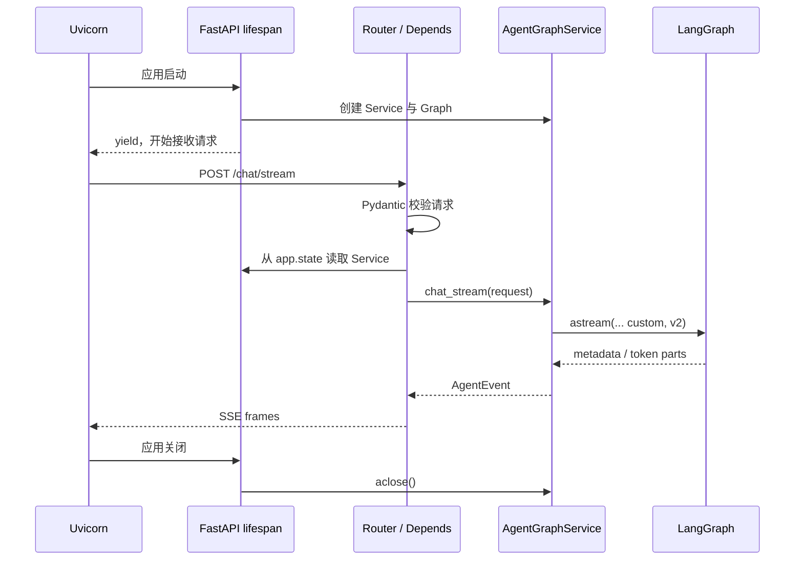
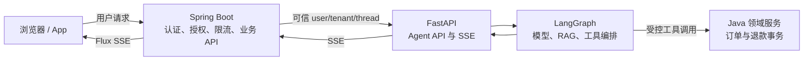

# 第 9 章：FastAPI 分层、生命周期、SSE 与 Java 流式转发

> 本章状态：内容完成。验证日期：2026-09-07。关键依赖：FastAPI 0.141.1、Starlette 1.6.0、LangGraph 1.2.11、HTTPX 0.28.1、Python 3.12。

## 1. 本章解决的问题

前八章已经能够构建、持久化和暂停 LangGraph，但 Graph 仍只是 Python 进程内的可调用对象。企业系统需要把它变成稳定的网络能力：

1. HTTP 请求、业务编排和 Graph 代码怎样分层？
2. Graph、模型 Client 和数据库连接应在什么时候创建与关闭？
3. FastAPI 的 `Depends` 到底注入了什么？
4. `ainvoke()` 与 `astream()` 的结果怎样分别变成 JSON 和 SSE？
5. Java 后端如何转发流，而不等 Python 全部生成后再一次性返回？

本章只保留一条推荐主线：

```text
Uvicorn
  -> FastAPI lifespan 创建 AgentGraphService
  -> Router 校验 ChatRequest
  -> Depends 从 app.state 取得共享 Service
  -> Service 调用 graph.ainvoke / graph.astream
  -> Router 返回 JSON / StreamingResponse
  -> Java WebClient 逐个转发 SSE 事件
```

这套分层的目标不是增加文件数量，而是把 HTTP 协议、应用用例、Agent 编排和资源生命周期分开，使每一层都能独立测试和替换。

## 2. 背景与技术动机

### 2.1 为什么不能在 Router 中创建所有对象

下面的代码能够运行，但每次请求都会创建 Service 和 Graph：

```python
@app.post("/chat")
async def chat(request: ChatRequest):
    service = AgentGraphService()
    return await service.chat(request)
```

当 Service 内部拥有模型 Client、HTTP 连接池、Qdrant Client 或 PostgreSQL Checkpointer 时，这会导致重复初始化、连接泄漏和难以测试。Router 也会同时承担协议适配、对象装配和业务编排。

正确边界是：应用启动时创建长生命周期资源，请求处理时只取得并使用它们，应用关闭时统一释放。

### 2.2 为什么普通 JSON 不够

模型可能需要数秒到数十秒才生成完整答案。如果使用 `ainvoke()` 等待全部结果，用户在这段时间看不到任何反馈。流式输出可以先传送元数据和文本片段，再发送完成事件。

流式输出没有降低模型总计算量，也不一定缩短最终完成时间；它主要降低“首个可见结果”的等待时间，并让前端能展示执行进度。

### 2.3 为什么这里选择 SSE

Server-Sent Events（SSE）是在一个 HTTP 响应中，由服务端持续向客户端发送文本事件的协议。Agent 文本输出主要是服务端单向推送，因此 SSE 通常比 WebSocket 更简单：

| 需求 | 更合适的方案 |
| --- | --- |
| 请求一次，服务端持续返回文本和状态 | SSE |
| 客户端与服务端都要持续主动发送消息 | WebSocket |
| 等待完整结果后返回一个对象 | 普通 JSON |

SSE 不是“返回许多个 HTTP 响应”。它是一条响应连接，响应体按事件帧逐步到达。

## 3. 核心心智模型

### 3.1 六层最小结构

本章示例位于 `examples/chapter09_fastapi_sse`：

```text
schemas.py       HTTP 输入输出 DTO 与校验
agent_graph.py   State、Node、Edge 和 Graph 构建
service.py       Agent 应用用例，封装 ainvoke / astream
dependencies.py FastAPI 依赖解析
router.py        HTTP 路由与响应类型转换
app.py           应用创建与 lifespan
sse.py           应用事件到 SSE 文本帧的编码
```

依赖方向保持单向：Router 可以依赖 Service，Service 可以依赖 Graph；Graph 不应反过来导入 FastAPI Router。

### 3.2 `APIRouter` 只组织 HTTP 入口

```python
router = APIRouter(
    prefix="/api/v1/agent",
    tags=["Agent"],
)
```

- `prefix` 自动加在该 Router 的所有路径前；
- `tags` 只影响 OpenAPI/Swagger UI 分组；
- 它不会启动端口，也不会自动创建 Service。

随后由 `app.include_router(router)` 把这些路由注册到 FastAPI 应用。

### 3.3 Pydantic Schema 是 HTTP 契约

```python
class ChatRequest(BaseModel):
    user_id: str
    thread_id: str
    message: str
```

FastAPI 收到 JSON 后，会把它解析为 `ChatRequest`。字段类型错误或校验失败时，Router 函数不会执行，框架直接返回 `422`。

```python
@field_validator("user_id", "thread_id", "message")
@classmethod
def validate_not_blank(cls, value: str) -> str:
    cleaned_value = value.strip()
    if not cleaned_value:
        raise ValueError("字段不能只包含空格")
    return cleaned_value
```

这里的执行顺序是：Pydantic 把单个字段值传给类方法，`strip()` 去掉首尾空白；若结果为空就抛出验证错误，否则返回清理后的值。`@classmethod` 让第一个参数是模型类 `cls`，而不是某个已构造的实例。

响应端：

```python
@router.post("/chat", response_model=ChatResponse)
```

`response_model` 告诉 FastAPI 用 `ChatResponse` 校验、序列化并生成 OpenAPI 响应文档。它不负责接收请求，也不会自动调用模型。

### 3.4 `lifespan` 管理整个应用进程的资源

```python
@asynccontextmanager
async def lifespan(app: FastAPI):
    service = AgentGraphService()
    app.state.agent_graph_service = service
    try:
        yield
    finally:
        await service.aclose()
```

真实执行顺序：

1. Uvicorn 启动 FastAPI 应用；
2. 进入 `lifespan()`，执行 `yield` 之前的初始化；
3. Service 被保存到 `app.state`，应用开始接收多个请求；
4. 整个运行期间暂停在 `yield`；
5. 应用关闭时从 `yield` 后继续；
6. `finally` 释放 Service 持有的资源。

`yield` 在这里不是向浏览器持续发送数据。它把应用运行期夹在“启动”和“关闭”之间。SSE 中的 `yield` 属于另一个异步生成器，作用完全不同。

### 3.5 `app.state` 存实例，`Depends` 负责按请求取出

```python
def get_agent_service(request: Request) -> AgentGraphService:
    return request.app.state.agent_graph_service
```

这段依赖函数没有创建 Service，只是从当前应用读取 lifespan 已经创建的实例。

```python
AgentServiceDep = Annotated[
    AgentGraphService,
    Depends(get_agent_service),
]
```

应拆成两部分理解：

- `AgentGraphService`：参数在 Python 类型系统中的类型；
- `Depends(get_agent_service)`：告诉 FastAPI 在处理请求时调用哪个依赖函数取得值。

`AgentServiceDep` 是一个类型别名。Router 声明：

```python
async def chat(request: ChatRequest, service: AgentServiceDep):
```

FastAPI 会先解析 `ChatRequest`，再调用依赖函数，将返回的 Service 传给 `service`。这与 Spring 注入的目标相似，但 FastAPI 没有自动扫描并维护完整 Bean 容器；对象仍由代码在 lifespan 中明确创建。

### 3.6 Service 隔离 HTTP 与 LangGraph

普通响应方法：

```python
result = await self._graph.ainvoke(request.model_dump())
return ChatResponse(
    thread_id=request.thread_id,
    answer=result["answer"],
)
```

`request.model_dump()` 将 Pydantic 对象转成 Graph 接收的普通字典。`await graph.ainvoke(...)` 异步等待整个 Graph 结束，返回最终 State；Service 再把内部 State 映射为稳定的 HTTP Response DTO。

不要直接把完整 State 暴露给前端。State 可能包含内部路由、Prompt、检索片段或调试字段，且它的结构会随工作流演进。

流式方法使用：

```python
async for part in self._graph.astream(
    request.model_dump(),
    stream_mode="custom",
    version="v2",
):
    if part["type"] == "custom":
        yield part["data"]
```

这里发生两层异步：

- `await` 等待一个异步操作完成；
- `async for` 等待异步迭代器的下一项，每到一项就立刻处理；
- `yield` 交出一个事件后保留函数当前位置，下一次迭代再继续。

因此 `chat_stream()` 返回的是 `AsyncIterator[AgentEvent]`，而不是已经装满所有事件的列表。

### 3.7 `stream_mode` 决定 LangGraph 暴露哪类数据

LangGraph 常用模式：

| 模式 | 产生的数据 | 典型用途 |
| --- | --- | --- |
| `messages` | LLM 消息片段与 metadata | 真实 Chat Model token 流 |
| `updates` | 每个 Node 的局部 State 更新 | 观察节点结果 |
| `values` | 每一步后的完整 State | 调试状态演化 |
| `custom` | Node/Tool 主动写出的任意事件 | 进度、业务状态、非标准模型流 |

本章使用确定性 Node，不调用真实 Chat Model，所以选择 `custom`：

```python
writer = get_stream_writer()
writer({"event": "token", "data": {"content": chunk}})
```

若不设置 `stream_mode="custom"`，这些 writer 事件不会成为本次流的 custom 输出。Graph 仍可能运行完，但调用方接收到的内容将由所选或默认 stream mode 决定。

`version="v2"` 将每一项统一为：

```python
{
    "type": "custom",
    "ns": (),
    "data": {"event": "token", "data": {...}},
}
```

因此 Service 先判断 `part["type"]`，再取 `part["data"]`。v1 的返回形状会随单模式、多模式和子图选项变化；课程选择 v2 是为了固定接收逻辑。

### 3.8 `StreamingResponse` 消费异步迭代器

Router 中的代码：

```python
event_stream = (
    encode_sse(event)
    async for event in service.chat_stream(request)
)
```

这是一条异步生成器表达式：每当 Service 产出一个 `AgentEvent`，它调用 `encode_sse()` 转成字符串。此时并没有预先遍历并保存全部结果。

```python
return StreamingResponse(
    content=event_stream,
    media_type="text/event-stream",
    headers={
        "Cache-Control": "no-cache",
        "X-Accel-Buffering": "no",
    },
)
```

- `content`：可逐项产生 `str`/`bytes` 的同步或异步迭代器；
- `media_type`：声明响应体遵循 SSE 文本事件格式；
- `Cache-Control: no-cache`：避免中间缓存保存实时流；
- `X-Accel-Buffering: no`：提示常见 Nginx 配置不要攒满缓冲区再发送。

`StreamingResponse` 只负责边产生边写出。若上游先用 `ainvoke()` 得到完整答案，再一次性 `yield`，网络层仍然只是“一大块”，不是真正的模型流式体验。

### 3.9 SSE 帧为什么这样格式化

```python
return f"event: {event_name}\ndata: {json_data}\n\n"
```

一个事件包含若干 `字段: 值` 行，空行表示该事件结束：

```text
event: token
data: {"content":"你好"}

```

- `event:` 是业务事件名，例如 `metadata`、`token`、`done`、`error`；
- `data:` 是事件数据，本章统一放 JSON；
- 最后的 `\n\n` 不能省略，否则客户端可能继续等待当前事件结束。

`media_type="text/event-stream"` 只设置协议类型，不会替你把 Python 字典编码成合法 SSE 帧，所以仍需要 `encode_sse()`。

### 3.10 Uvicorn 是 ASGI Server

FastAPI 对象描述路由、依赖和生命周期，但它自己不是监听端口的网络服务器。运行：

```powershell
uv run uvicorn examples.chapter09_fastapi_sse.app:app --reload
```

含义是：

- `uvicorn`：启动 ASGI Server；
- `examples.chapter09_fastapi_sse.app`：导入 Python 模块；
- 冒号后的 `app`：找到该模块中的 FastAPI 对象；
- `--reload`：开发时监视文件变化并重启，生产部署通常不使用。

右键直接运行只有 `app = FastAPI(...)` 的文件会立刻结束，是因为创建对象并不等于启动服务器。

### 3.11 Java 流式转发为什么首选 `WebClient`

Spring WebFlux `WebClient` 是非阻塞、支持流的 HTTP Client，可以将 Python 的 SSE 响应解码为：

```java
Flux<ServerSentEvent<String>>
```

核心调用：

```java
return agentWebClient.post()
    .uri("/api/v1/agent/chat/stream")
    .contentType(MediaType.APPLICATION_JSON)
    .accept(MediaType.TEXT_EVENT_STREAM)
    .bodyValue(request)
    .retrieve()
    .bodyToFlux(
        new ParameterizedTypeReference<ServerSentEvent<String>>() {}
    );
```

这里 `Flux` 不是已经完成的 `List`。Python 每到一个 SSE 事件，Java 就可以收到并继续向前端写出。

OpenFeign 适合普通声明式 HTTP 调用，但 Spring Cloud OpenFeign 官方文档说明其核心并不提供 reactive client 支持。因此，本课程对 SSE 转发的默认选择是 `WebClient`；普通 JSON 的内部服务调用仍可使用 OpenFeign。

## 4. 输入、输出与执行流程

### 4.1 应用启动、请求和关闭



### 4.2 Java 与 Python 的企业边界



Java 不应把客户端提交的 `user_id` 和 `tenant_id` 原样当成可信身份转发。它应根据认证主体构造 Python 请求。Python 也不能仅凭 Header 名称就默认可信；服务间鉴权和网络边界必须成立。

### 4.3 SSE 事件契约

企业协议可以采用以下四种应用事件；当前确定性 Demo 发出前三种，`error` 留作生产错误映射：

| event | data | 用途 |
| --- | --- | --- |
| `metadata` | `thread_id` 等 | 建立前端本次流的上下文 |
| `token` | `content` | 追加显示文本片段 |
| `done` | 最终标识 | 正常结束 |
| `error` | 稳定错误码与安全消息 | 生产环境中的流内失败通知 |

HTTP 状态码只能在响应头发出前确定。若已经发送若干 token 后才出错，通常不能再把状态码改成 `500`，需要用 `event: error` 表达流内错误，并记录服务端日志与 trace ID。

## 5. 最小可运行示例

完整示例位于 [`examples/chapter09_fastapi_sse`](https://github.com/MIRS571/java-backend-to-agent/tree/main/examples/chapter09_fastapi_sse)。在仓库根目录启动：

```powershell
uv run uvicorn examples.chapter09_fastapi_sse.app:app --reload
```

普通响应可在 <http://127.0.0.1:8000/docs> 中调用。观察 SSE 分块时使用目录 README 中的 `curl.exe -N` 命令；Swagger UI 适合检查接口结构，但不适合验证每一块的到达时间。

示例使用确定性异步 Node，输出顺序固定为：

```text
metadata -> token -> token -> done
```

Java 集成核心代码位于 [`AgentSseRelay.java`](https://github.com/MIRS571/java-backend-to-agent/blob/main/examples/chapter09_fastapi_sse/java/AgentSseRelay.java)。它展示 `WebClient` 的流式接收边界，不在本 Python 教学仓库中引入完整 Maven 项目。

## 6. 关键 API 解释

| API / 语法 | 接收什么 | 返回什么 / 何时发生 | 关键边界 |
| --- | --- | --- | --- |
| `FastAPI(lifespan=...)` | async context manager | 带应用生命周期的 ASGI app | 不负责监听端口 |
| `@asynccontextmanager` | 含一次 `yield` 的 async generator | 异步上下文管理器 | `yield` 前启动，后面关闭 |
| `app.state` | 任意应用级对象 | 同一 app 内可读取的状态 | 不是分布式共享存储 |
| `Depends(callable)` | 依赖函数/可调用对象 | 请求处理时解析出的值 | 不等于完整 Spring IoC 容器 |
| `Annotated[T, Depends(...)]` | 类型与依赖元数据 | 可复用类型别名 | 方括号不是数组 |
| `response_model=...` | Pydantic 模型类 | 响应校验、序列化与 OpenAPI Schema | 不定义请求体 |
| `await graph.ainvoke()` | 初始 State | 完成后的最终 State | 不逐块返回 |
| `graph.astream()` | 初始 State、模式、版本 | 异步事件迭代器 | 必须消费 `async for` |
| `get_stream_writer()` | 当前 Graph 运行上下文 | 可调用 writer | Graph 外部直接调用不可用 |
| `stream_mode="custom"` | 自定义流模式 | writer 发出的事件 | 不自动等于模型 token |
| `version="v2"` | 流输出版本 | `{type, ns, data}` 统一结构 | v1 形状不同 |
| `AsyncIterator[T]` | 类型声明 | 可异步逐项消费的序列 | 不是 `list[T]` |
| `yield` | 本次产生的单项 | 暂停生成器并保留位置 | 不等于 `return` 结束函数 |
| `StreamingResponse` | iterator / async iterator | 分块 HTTP 响应 | 不会让非流式上游自动流式化 |
| `text/event-stream` | HTTP media type | 声明 SSE 协议 | 仍需正确的事件帧格式 |
| `Flux<ServerSentEvent<String>>` | 连续 SSE 事件 | Java reactive stream | 不应 `.block()` 后再转发 |

## 7. Java / Spring 类比

| Python / FastAPI | Java / Spring 类比 | 类比边界 |
| --- | --- | --- |
| Pydantic `BaseModel` | Request/Response DTO + Bean Validation | Pydantic 的转换与错误格式不同 |
| `APIRouter` | `@RestController` 的路径分组 | Router 是对象，可组合注册 |
| `Depends` | 方法参数依赖解析 / DI | 没有 Spring 完整 Bean 扫描和作用域体系 |
| `app.state` | Application-scoped holder | 不是推荐的任意全局变量仓库 |
| lifespan | Bean 创建与 `@PreDestroy` 生命周期 | 由 ASGI 应用生命周期驱动 |
| `AgentGraphService` | Application Service | 它包装 Agent 用例，不拥有 Java 领域事务 |
| `ainvoke()` | `Mono<Result>` 最终完成 | Python coroutine 只有 await 后才执行到完成 |
| async generator | `Flux<T>` | 异步生成器通常是单消费者拉取模型 |
| `StreamingResponse` | WebFlux 流式响应 | 底层协议与背压实现并不完全相同 |
| Uvicorn | 嵌入式 Netty/Tomcat 的服务器角色 | Uvicorn 运行 ASGI，线程与并发模型不同 |

## 8. Demo 与企业级写法

| 当前 Demo | 企业级实现应补充 |
| --- | --- |
| 单文件应用装配 | 配置模块、结构化日志、统一异常映射和版本化 API |
| `app.state` 一个 Fake Service | lifespan 管理模型/Qdrant/PostgreSQL/HTTP 连接池 |
| 确定性 custom chunks | 真实模型 `messages` 流、Tool/RAG 进度与事件白名单 |
| 无 Checkpointer | 异步 PostgreSQL Saver 和稳定 `thread_id` |
| 请求体携带 user_id | Java 认证后生成可信身份，Python 做服务间鉴权 |
| 无流内错误事件 | `error` 事件、稳定 code、trace ID，隐藏内部异常 |
| 无取消处理 | 客户端断开后传播 cancellation，停止模型和下游请求 |
| 无超时与限流 | 首 token 超时、总时长、并发数、token/成本预算 |
| Nginx 提示 Header | 同时配置反向代理、网关和负载均衡器关闭缓冲 |
| Java 仅有 relay 核心 | WebClient timeout、连接池、错误映射、指标和断开传播 |

SSE 长连接会占用连接与并发预算。必须限制单用户连接数、总执行时间和模型成本；不能只依赖普通短请求的超时配置。

## 9. 局限性与常见错误

### 9.1 `event_stream = service.chat_stream(request)` 为什么还没有执行完

它得到异步生成器对象。真正迭代由 `StreamingResponse` 在发送响应体时发生。把生成器改成 `[event async for ...]` 会先收集全部结果，失去流式效果。

### 9.2 忘记 SSE 的空行

只有 `data: ...\n` 而没有最终空行时，客户端可能认为事件尚未结束。统一使用编码函数，避免 Router 到处手写格式。

### 9.3 只设置 `media_type` 就以为完成 SSE

`text/event-stream` 是协议声明，响应体还必须按 `event:`、`data:` 和空行组织。反过来，只有文本格式但 Content-Type 错误也会导致客户端不能按 SSE 处理。

### 9.4 Graph 使用 `ainvoke()`，外层再假装切分

完整答案生成后按字符切开，只是网络层分块，不会改善首 token 延迟，也不能展示工具和检索过程。真正的流应从模型或 Graph 执行期间产生。

### 9.5 混淆 `messages` 与 `custom`

`messages` 专注 Chat Model 消息片段；`custom` 是节点主动写出的应用事件。前端协议通常还需要 Service 做一次白名单映射，不应把 LangGraph 原始调试事件全部公开。

### 9.6 在每个请求中创建 Client

这会失去连接池复用并增加资源泄漏风险。长生命周期 Client 和 Graph 在 lifespan 创建，按请求信息通过参数或 Runtime Context 传入。

### 9.7 Java 收到 Flux 后调用 `.block()`

阻塞并等待完整流会破坏非阻塞转发，甚至造成线程资源问题。Controller 应直接返回 `Flux`，让 WebFlux 持续向下游发送。

### 9.8 默认使用 OpenFeign 转发 SSE

OpenFeign 的优势是普通声明式请求，不是 reactive stream。SSE 主线使用 WebClient；不要因为项目已有 Feign 就强行让所有协议经过同一个 Client。

### 9.9 Swagger 页面看起来一次性出现结果

这不一定说明服务没有流式发送。文档 UI、浏览器、测试 Client 或代理都可能缓冲。应使用 `curl -N` 或专门的流式 Client，并检查反向代理缓冲设置。

### 9.10 忽略客户端断开

客户端关闭页面后，上游模型若继续生成，会浪费费用和连接。不要吞掉 `CancelledError`；生产代码应把取消传播到 Graph、模型调用和 Java 转发链。

### 9.11 浏览器原生 `EventSource` 与 POST

原生 `EventSource` 以 URL 建立 GET 流，不方便携带 JSON 请求体。本章使用 POST，因为 Java `WebClient` 可以消费它。若浏览器要直接连接，可采用“先 POST 创建运行，再 GET 订阅事件”，或使用支持 fetch streaming 的前端实现。

## 10. 本章总结

- FastAPI Router 负责 HTTP 适配，Service 负责 Agent 用例，Graph 负责状态与控制流。
- lifespan 在应用启动时创建共享资源，在关闭时统一释放；它不为每个请求重复执行。
- `Depends` 根据请求解析依赖，`Annotated` 同时保留类型与 FastAPI 元数据。
- `ainvoke()` 返回完整最终 State；`astream()` 返回可逐项消费的异步流。
- `stream_mode` 决定观察消息、状态还是自定义事件；v2 统一为 `{type, ns, data}`。
- `StreamingResponse` 消费异步迭代器，但上游本身也必须真正逐步产生数据。
- SSE 使用 `text/event-stream`，每个 `event:`/`data:` 帧以空行结束。
- Java 转发 SSE 首选 `WebClient + Flux`，普通 JSON 调用仍可使用 OpenFeign。
- Java 继续负责用户认证、授权和业务事务；Python 负责模型、RAG 与 Agent 编排。

## 11. 思考题

1. 为什么 `lifespan` 中的 `yield` 和 `chat_stream()` 中的 `yield` 含义不同？它们分别暂停在哪里？
2. `AgentServiceDep = Annotated[AgentGraphService, Depends(get_agent_service)]` 中，类型和依赖元数据分别起什么作用？
3. 为什么 `StreamingResponse` 包住 `ainvoke()` 的完整结果，仍不算真正的 Agent 流式输出？
4. `stream_mode="messages"` 与 `stream_mode="custom"` 应分别用于什么场景？
5. Java 网关转发 SSE 时为什么优先使用 WebClient？哪些普通调用仍适合 OpenFeign？

## 12. 官方参考资料与验证版本

官方资料：

- [FastAPI：Lifespan Events](https://fastapi.tiangolo.com/advanced/events/)
- [FastAPI：Dependencies](https://fastapi.tiangolo.com/tutorial/dependencies/)
- [FastAPI：Custom Response 与 StreamingResponse](https://fastapi.tiangolo.com/advanced/custom-response/)
- [Starlette：StreamingResponse](https://www.starlette.io/responses/#streamingresponse)
- [LangGraph：Streaming](https://docs.langchain.com/oss/python/langgraph/streaming)
- [WHATWG HTML：Server-Sent Events](https://html.spec.whatwg.org/dev/server-sent-events.html)
- [Spring Framework：WebClient](https://docs.spring.io/spring-framework/reference/web/webflux-webclient.html)
- [Spring Framework：WebClient retrieve](https://docs.spring.io/spring-framework/reference/web/webflux-webclient/client-retrieve.html)
- [Spring Cloud OpenFeign：Reactive Support](https://docs.spring.io/spring-cloud-openfeign/docs/current/reference/html/#reactive-support)

资料于 2026-09-07 核对。Python 示例使用 FastAPI 0.141.1、Starlette 1.6.0、LangGraph 1.2.11、HTTPX 0.28.1 与 Python 3.12。离线测试验证 `ainvoke`、v2 custom stream、SSE 编码、lifespan 创建/关闭、Depends 取值、HTTP JSON/SSE 契约和请求校验；不验证真实网络分块时序、Java 编译、代理缓冲、真实模型、断线取消或生产鉴权。
