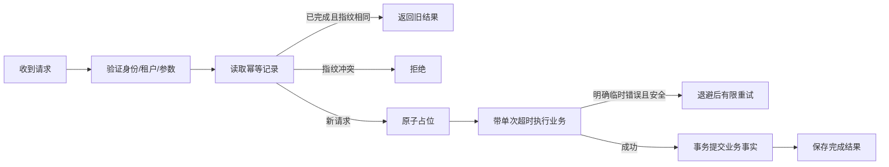
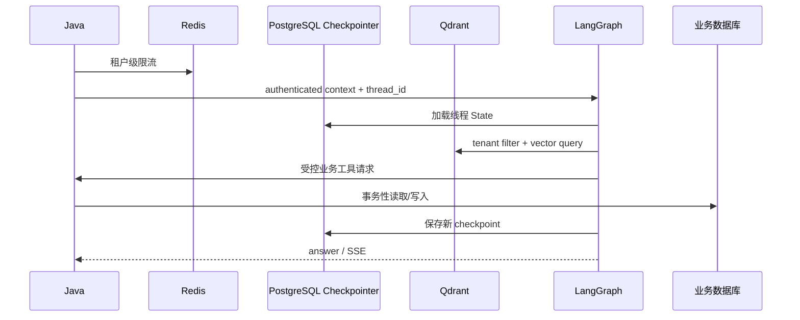

# 第 10 章：PostgreSQL、Redis、Qdrant、Docker、幂等与重试

> 本章状态：内容完成。验证日期：2026-09-07。关键环境：Python 3.12、Docker Compose 配置规范、PostgreSQL 18、Redis 8、Qdrant 1.18.2。

## 1. 本章解决的问题

企业 Agent 同时出现 PostgreSQL、Redis、Qdrant 和业务数据库，并不代表它们可以互相替换。本章解决三类问题：

- 每一种存储究竟拥有什么数据；
- Docker Compose 能保证什么，不能保证什么；
- 超时、重试和幂等怎样组合，避免高风险操作重复执行。

核心结论：先按数据语义和正确性要求选择存储，再考虑性能。不要因为 Redis 快就把业务事实搬进去，也不要因为 Qdrant 能保存 payload 就把它当订单数据库。

## 2. 背景与技术动机

Agent 请求可能同时经历对话恢复、知识检索、业务查询和退款写入。这些数据的查询方式、寿命和一致性要求完全不同：

```text
会话恢复 -> PostgreSQL Checkpointer
知识检索 -> Qdrant
缓存/限流/短期协调 -> Redis
订单与退款事实 -> Java + MySQL/PostgreSQL 业务库
```

把它们合并到一个存储看似简单，却会丢失各自最重要的能力。企业设计的关键不是“用了多少中间件”，而是故障时知道哪些数据可以丢、哪些可以重算、哪些绝不能重复。

## 3. 核心心智模型

### 3.1 四种存储的职责

| 组件 | 主要数据 | 典型查询 | 故障策略 |
| --- | --- | --- | --- |
| 业务关系库 | 订单、退款、权限、审计事实 | 主键、条件、事务 | 写操作通常 fail closed |
| PostgreSQL Checkpointer | LangGraph State 快照、线程位置 | `thread_id`、checkpoint | 不能恢复时明确失败 |
| Redis | 缓存、限流计数、短期幂等协调 | Key、TTL、原子脚本 | 按用途选择降级或拒绝 |
| Qdrant | Embedding、Document payload | 向量相似度 + metadata filter | RAG 可返回无可靠知识 |

业务关系库和 Checkpointer 都可能使用 PostgreSQL，但逻辑所有权仍应分开：前者是领域事实，后者是工作流运行记录。不能通过直接修改 checkpoint 表来改变订单状态。

### 3.2 多租户边界必须进入每次访问

所有共享存储都要有租户作用域：

```text
PostgreSQL thread ownership: tenant_id + user_id + thread_id
Redis key:                purpose:tenant_id:resource_id
Qdrant filter:            tenant_id == authenticated tenant
业务 SQL:                 tenant_id + business primary key
```

租户过滤必须发生在数据库查询或向量检索内部，而不是先取全量数据再由 Python 删除不属于当前租户的结果。

### 3.3 Redis 的不同用途需要不同故障策略

- **订单读取缓存**不可用：可以限流后回源业务服务，属于可降级能力；
- **聊天限流**不可用：高成本接口通常应保守拒绝或切换本地小额度保护；
- **退款幂等**不可用：不能假装没见过该请求，应 fail closed，避免重复退款；
- **普通展示缓存**不可用：通常可直接绕过。

“Redis 挂了就放行”不是通用策略。是否放行取决于 Redis 在该场景中保护的是性能还是业务正确性。

### 3.4 幂等不是一把 Redis 锁

幂等含义是：同一个逻辑请求执行多次，业务效果仍与执行一次相同。典型请求携带稳定 `idempotency_key`，服务端还应保存请求指纹：

```text
第一次 key + payload -> 执行业务 -> 保存完成结果
相同 key + 相同 payload -> 返回已保存结果
相同 key + 不同 payload -> 409 conflict
```

请求指纹来自规范化 payload 的哈希，用于阻止调用者把同一个 key 用于不同金额或订单。

生产幂等通常至少有 `PROCESSING`、`COMPLETED`、失败和未知结果状态。Redis 的原子占位只解决竞争入口；最终业务效果仍由关系数据库唯一约束、条件更新或事务保证。

### 3.5 重试先回答“是否安全”

只有同时满足以下条件才重试：

1. 错误被明确分类为临时错误；
2. 操作本身是只读或已具备幂等保护；
3. 有最大次数、单次超时和总时间预算；
4. 使用指数退避，生产中通常再加入 jitter；
5. 最终失败能被观察并正确映射。

不要对所有异常使用无限重试。参数错误、权限失败和业务拒绝不会因等待而变正确；没有幂等保护的退款 POST 也不能盲目重试。

### 3.6 超时、重试与幂等的顺序



若客户端超时但服务端可能已经提交，结果属于“未知”而不是“失败”。客户端不能换一个新幂等键重发，否则可能形成第二次业务效果。

### 3.7 Docker Compose 管理本地拓扑，不提供生产保证

本章 Compose 文件提供 PostgreSQL、Redis 和 Qdrant 的本地学习环境。named volume 让容器重建后数据仍可保留，回环端口避免默认暴露到外部网络。

`depends_on` 只描述依赖顺序；容器进程已启动不等于服务可用。需要 `healthcheck` 与 `condition: service_healthy` 才能等待依赖达到健康状态。但即使健康检查通过，也不代表具备备份、加密、高可用和灾难恢复。

## 4. 输入、输出与执行流程

### 4.1 一次 Agent 请求的数据路径



### 4.2 退款幂等流程

Java 业务服务应是退款事实的最终拥有者。Python Graph 可以决定“需要请求退款工具”，但 Java 必须再次验证认证身份、订单归属、订单状态、金额和幂等键。

Redis 可加速并发协调与结果复用；MySQL/PostgreSQL 中的条件更新和唯一约束负责最终正确性。模型的 Tool Call 不是授权凭证。

## 5. 最小可运行示例

离线示例位于 [`examples/chapter10_infrastructure_reliability`](https://github.com/MIRS571/java-backend-to-agent/tree/main/examples/chapter10_infrastructure_reliability)。在仓库根目录运行：

```powershell
uv run python -m examples.chapter10_infrastructure_reliability.reliability_demo
```

它验证：两次相同请求只调用一次退款函数；相同 key 配不同 payload 会报冲突；读取操作遇到声明的临时错误时最多重试三次。

本地 Compose 学习拓扑位于 [`infra/enterprise`](https://github.com/MIRS571/java-backend-to-agent/tree/main/infra/enterprise)。它不会被自动启动，也不包含真实密码。

## 6. 关键 API 解释

| 概念/API | 输入 | 输出或副作用 | 关键边界 |
| --- | --- | --- | --- |
| `AsyncPostgresSaver` | PostgreSQL 连接字符串 | 异步 checkpoint 读写 | 与 `ainvoke/astream` 配套 |
| `checkpointer.setup()` | 已建立连接 | 创建所需表结构 | 首次/迁移阶段执行，不应每请求执行 |
| Redis `SET ... NX EX/PX` | key、唯一值、TTL | 仅不存在时原子写入 | 不等于完整业务幂等 |
| Redis Lua | keys、args、脚本 | 单次原子执行复合操作 | 脚本要短且可测试 |
| Qdrant payload filter | metadata 条件 | 检索候选范围收窄 | tenant filter 必须在查询内 |
| payload index | 字段与类型 | 加速过滤 | `tenant_id` 通常使用 keyword |
| `request_fingerprint()` | 规范化请求 | SHA-256 字符串 | 不包含密钥和不稳定字段 |
| 指数退避 | attempt、base、cap | 下一次等待时间 | 生产通常加入 jitter |
| Docker named volume | volume 名称 | 容器外持久数据 | 仍需备份与恢复演练 |

## 7. Java / Spring 类比

| 本章概念 | Java/Spring 对应 | 边界 |
| --- | --- | --- |
| Checkpointer PostgreSQL | 工作流实例仓库 | 不是订单 Repository |
| Redis cache-aside | Spring Cache 常见模式 | 缓存失效与一致性仍需设计 |
| Redis 原子限流 | Gateway Filter + Lua | 不应只按 IP，需用户/租户维度 |
| 幂等记录 | 请求表/唯一索引 | Redis 不能替代业务事务 |
| 有限重试 | Spring Retry / Resilience4j | 只有安全操作才能重试 |
| Runtime Context | 请求级可信上下文 | 不把连接对象放进 Graph State |

## 8. Demo 与企业级写法

| Demo | 企业级补充 |
| --- | --- |
| 内存幂等字典 | Redis 原子状态机 + 业务库唯一约束 |
| 只记录完成状态 | PROCESSING/COMPLETED/UNKNOWN、租约与接管规则 |
| 无并发 | Lua/事务/条件更新验证竞争 |
| 固定退避无 jitter | 完整 timeout budget、指数退避和随机抖动 |
| 本地 Compose 单实例 | 私有网络、认证、TLS、备份、高可用和容量监控 |
| 回环端口 | 生产不直接发布数据库端口 |
| Qdrant 逻辑过滤 | payload index、严格模式与大租户独立 shard 评估 |

## 9. 局限性与常见错误

- 把 Redis 当业务事实库：TTL、淘汰或故障可能丢失关键状态。
- 缓存 Key 缺少 `tenant_id`：不同租户可能读取同一条缓存。
- Qdrant 检索后才过滤租户：越权内容已经进入候选和上下文。
- 对 `Exception` 全部重试：把永久错误放大成流量风暴。
- POST 超时就换 key 重发：原请求可能已提交，造成重复效果。
- 只使用分布式锁：锁过期、客户端暂停和未知结果仍需业务约束。
- `docker compose up` 成功就称为生产可用：启动成功不等于安全和可恢复。
- 把密码写进 Compose：配置应从未提交的环境或密钥系统注入。

## 10. 本章总结

- 业务库保存领域事实，PostgreSQL Checkpointer 保存 Graph 快照，Redis 保存高频临时状态，Qdrant负责向量检索。
- 多租户作用域必须进入 SQL、Redis Key、thread ownership 和 Qdrant filter。
- Redis 故障是否降级取决于它保护的是性能还是正确性。
- 幂等需要稳定 key、请求指纹、状态机和最终业务约束，不只是一把锁。
- 只有临时错误和安全操作才能有限重试；退款等写操作先建立幂等保护。
- Compose 是可复现的开发拓扑，不等于生产部署。

## 11. 思考题

1. 为什么订单缓存和退款幂等在 Redis 不可用时应采用不同策略？
2. 相同幂等键为什么还要比较请求指纹？
3. 客户端超时后，为什么不能直接把请求判定为失败并换 key 重试？
4. Qdrant 的租户过滤为什么必须在向量查询内部执行？
5. PostgreSQL Checkpointer 与业务 PostgreSQL 即使使用同一产品，为什么仍应视为不同数据边界？

## 12. 官方参考资料与验证版本

- [LangGraph Persistence 与 Checkpointer](https://docs.langchain.com/oss/python/langgraph/persistence)
- [LangGraph Memory：生产 Postgres Checkpointer](https://docs.langchain.com/oss/python/langgraph/add-memory#use-in-production)
- [Redis SET 命令与 NX/EX/PX](https://redis.io/docs/latest/commands/set/)
- [Redis Rate Limiter](https://redis.io/docs/latest/develop/use-cases/rate-limiter/)
- [Qdrant Payload 与 Filter](https://qdrant.tech/documentation/concepts/payload/)
- [Qdrant Multitenancy](https://qdrant.tech/documentation/tutorials/multiple-partitions/)
- [Docker Compose 启动顺序与健康检查](https://docs.docker.com/compose/how-tos/startup-order/)

资料于 2026-09-07 核对。离线代码在 Python 3.12 下验证 Key 作用域、指纹稳定性、幂等复用/冲突和有限读取重试；Compose 文件验证 YAML 服务、回环端口和 named volume 结构，不启动数据库，不验证并发、故障恢复、真实事务或高可用。
