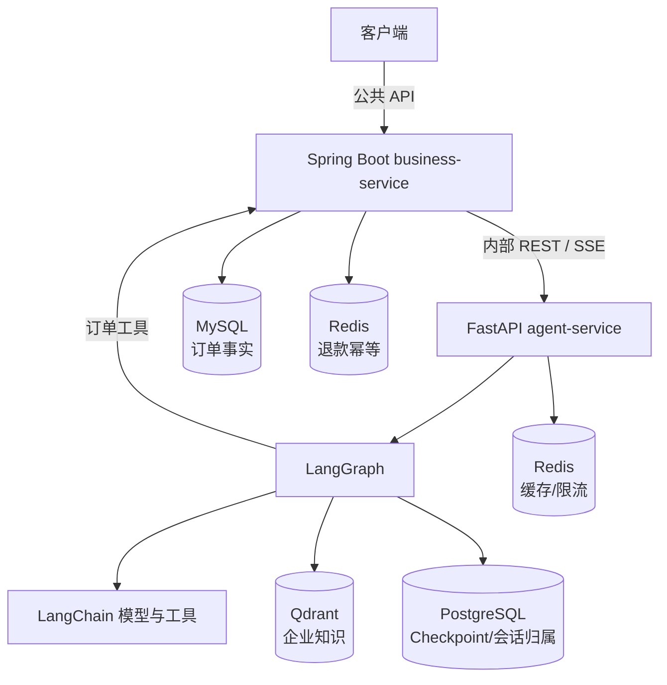
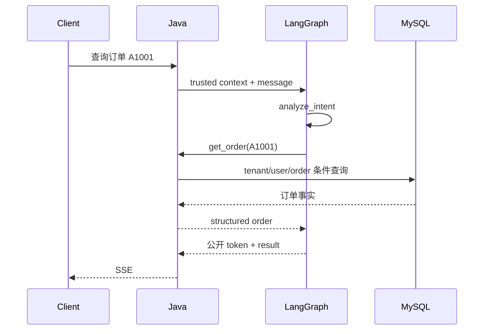
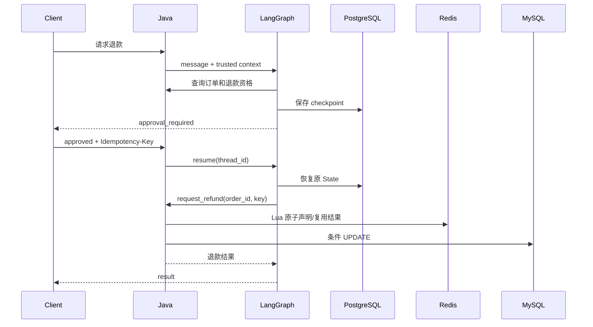

# 第 12 章：`enterprise-support-agent` 综合案例拆解

> 本章状态：内容完成。验证日期：2026-09-07。案例仓库快照：`9e7a708`。课程示例环境：Python 3.12、pytest 9.1.1。

## 1. 本章解决的问题

前 11 章分别学习了模型、工具、RAG、LangGraph、服务化、存储和质量边界。最后一章不再增加新框架，而是回答：这些部件如何组成一个能够解释、测试和演进的企业系统？

本章拆解独立项目 [`MIRS571/Enterprise-Support-Agent`](https://github.com/MIRS571/Enterprise-Support-Agent)，重点关注：

- 为什么外部请求先到 Java，而不是直接访问 Python Agent；
- 订单查询、政策 RAG、退款审批三条流程如何运行；
- State、Runtime、Checkpoint、Redis 和业务数据库如何各守边界；
- 应按什么顺序阅读完整项目，避免陷入文件和配置细节；
- 如何基于实际证据介绍项目，而不是堆叠技术名词。

课程仓库只提供架构导读和最小流程模型，不复制完整项目。

## 2. 背景与技术动机

把所有能力写进一个 Python 服务最省 Demo 代码，但会让模型编排层同时拥有认证、订单事务和退款权限。这样一旦发生 Prompt Injection、错误 Tool Call 或重复请求，影响会直接进入业务数据。

案例采用两类能力分工：

- **确定性业务能力**：认证身份、订单事实、退款规则、幂等和事务，由 Spring Boot 与关系数据库负责；
- **概率性智能能力**：自然语言理解、知识检索、回答生成和工作流编排，由 FastAPI、LangChain 与 LangGraph 负责。

这不是因为 Java 不能调用模型，也不是因为 Python 不能写事务。边界来自已有业务所有权、团队能力、安全风险和变化频率。模型层可以提出动作，但不能成为最终授权者。

## 3. 核心心智模型

### 3.1 从“技术列表”转成“责任地图”



| 部件 | 拥有的数据或决策 | 不负责 |
| --- | --- | --- |
| Java | 可信身份、订单事实、退款校验和事务 | 模型推理与 RAG |
| Python | Agent API、模型、检索和工作流 | 直接修改订单数据库 |
| LangChain | 模型适配、Prompt、Structured Output、工具接口 | 整个业务状态机 |
| LangGraph | State、节点、路由、流、暂停和恢复 | 业务授权与领域事务 |
| MySQL | 订单和退款最终事实 | 对话状态 |
| PostgreSQL | Graph checkpoint、公开会话归属 | 订单真相 |
| Qdrant | 向量与 metadata 检索 | 业务实体关系 |
| Redis | 缓存、限流、短期幂等状态 | 最终业务事实 |

### 3.2 State、Runtime 与外部存储的分界

案例中的 `AgentState` 保存可以序列化和恢复的工作流数据，例如 `message`、`intent`、`order_id`、知识引用和 `answer`。`AgentContext` 通过 `Runtime[AgentContext]` 向节点提供可信 `tenant_id`、`user_id` 和恢复退款时的 `idempotency_key`。

```text
State       = 这次工作流已经进行到哪里，可保存到 Checkpoint
Runtime     = 这次运行是谁发起的，以及节点可使用的可信请求上下文
外部存储    = 订单、知识、缓存等独立生命周期的数据
```

HTTP Client、Qdrant Client、连接池和 Service 等长期资源由 FastAPI `lifespan` 创建一次并在关闭时释放，不放进 State。否则 Checkpointer 无法稳定序列化资源，连接生命周期也会失控。

### 3.3 三条流程共用边界，不共用错误假设

订单查询、政策问答和退款都经过 Java 公共入口、可信身份传递和 LangGraph 路由；之后的正确性要求不同：

- 订单查询必须使用 Java 返回的业务事实；
- 政策问答必须先在 Qdrant 查询中执行租户 Filter，再把证据交给模型；
- 退款必须在人工审批之后，以稳定幂等键进入 Java 的事务写入。

## 4. 输入、输出与执行流程

### 4.1 公共入口

1. 客户端调用 Java `/api/v1/agent/**`；
2. Java 验证用户身份，得到可信 `tenant_id/user_id` 并生成 `request_id`；
3. `AgentServiceClient` 添加内部服务凭证，将请求转给 Python；
4. Python 校验内部调用方、会话归属和限流；
5. `SupportAgentService` 构造最小 State，通过 `context=AgentContext(...)` 调用 Graph；
6. Python 只公开允许的 SSE 事件，Java 使用 `WebClient`/`Flux` 原样转发。

开发版仍使用可信身份 Header 模拟第 2 步；生产必须由网关或 Spring Security 验证 JWT 后生成身份，不能直接相信外部 Header。

### 4.2 订单查询



模型负责理解问题和表达结果，订单状态来自 Java。即使模型声称“已退款”，也不会改变 MySQL。

### 4.3 政策 RAG

```text
policy_query
-> Qdrant tenant Filter 内部执行 Dense + BM25 召回
-> RRF 融合
-> Cross-Encoder 重排
-> Top K Document 格式化为编号上下文
-> 模型基于上下文生成回答
-> result 返回结构化 sources
```

写入流程与查询流程分离：文档先校验 catalog 和 metadata，再切分、生成稳定 chunk ID 并按文档替换。没有可靠上下文或 Qdrant 不可用时返回固定提示，不让模型凭记忆编写企业政策。

案例仓库记录的同口径评测中，最终 Hybrid + Cross-Encoder 链路的 Hit@3 和 MRR@3 都达到 100%，但 CPU 重排 P95 为 370.387 ms。这组数据只说明该数据集和环境中的准确率/延迟权衡，不能直接当作线上 SLO。

### 4.4 退款暂停与恢复



恢复请求只提交 `approved: bool` 和幂等键，不允许客户端重新提供原订单快照。订单号和上下文从 Checkpoint 恢复，避免批准时偷换业务对象。

### 4.5 流式输出

Graph 使用异步流读取 `messages` 与 `values`。服务只接受回答生成节点产生的 token，内部意图分析、工具参数和知识原文不会被转发。Python 把领域事件编码为：

```text
metadata
token ...
result | approval_required | error
done
```

Java 的 `WebClient.toEntityFlux(...)` 保留流和开始发送前的 HTTP 状态；Controller 返回 `Flux<ServerSentEvent<String>>`。链路中不能调用 `block()`、`collectList()` 或手动 `subscribe()`，否则会缓冲或破坏背压和生命周期。

## 5. 最小可运行示例

本章离线示例位于 [`examples/chapter12_capstone`](https://github.com/MIRS571/java-backend-to-agent/tree/main/examples/chapter12_capstone)。从课程仓库根目录运行：

```powershell
uv run python -m examples.chapter12_capstone.request_flow_demo
```

它不会伪造或缩小完整系统，而是把三条流程表示成可验证的 `FlowStep`：每一步明确 `owner` 和 `responsibility`。`validate_flow()` 检查公共入口、租户过滤以及“审批 → 幂等 → 事务退款”的安全顺序。

完整项目的启动、环境配置和真实测试以[案例仓库 README](https://github.com/MIRS571/Enterprise-Support-Agent)为准。

## 6. 关键代码入口

不要从配置文件逐个阅读。按一次请求的执行顺序进入：

1. [`AgentController.java`](https://github.com/MIRS571/Enterprise-Support-Agent/blob/main/business-service/src/main/java/com/mirs/agent/business/agent/controller/AgentController.java)：公共 API、可信身份和请求 ID；
2. [`AgentServiceClient.java`](https://github.com/MIRS571/Enterprise-Support-Agent/blob/main/business-service/src/main/java/com/mirs/agent/business/agent/client/AgentServiceClient.java)：Java 到 Python 的 REST/SSE 契约；
3. [`main.py`](https://github.com/MIRS571/Enterprise-Support-Agent/blob/main/agent-service/src/agent_service/main.py) 与 [`lifespan.py`](https://github.com/MIRS571/Enterprise-Support-Agent/blob/main/agent-service/src/agent_service/core/lifespan.py)：应用装配和资源生命周期；
4. [`state.py`](https://github.com/MIRS571/Enterprise-Support-Agent/blob/main/agent-service/src/agent_service/graph/state.py)：State 与 Runtime Context 的边界；
5. [`builder.py`](https://github.com/MIRS571/Enterprise-Support-Agent/blob/main/agent-service/src/agent_service/graph/builder.py) 和 [`routing.py`](https://github.com/MIRS571/Enterprise-Support-Agent/blob/main/agent-service/src/agent_service/graph/routing.py)：完整拓扑和分支；
6. [`nodes.py`](https://github.com/MIRS571/Enterprise-Support-Agent/blob/main/agent-service/src/agent_service/graph/nodes.py)：节点怎样调用 RAG、订单工具与 `interrupt`；
7. [`support_agent.py`](https://github.com/MIRS571/Enterprise-Support-Agent/blob/main/agent-service/src/agent_service/services/support_agent.py)：`ainvoke`、`astream`、恢复和领域结果映射；
8. [`retrieval.py`](https://github.com/MIRS571/Enterprise-Support-Agent/blob/main/agent-service/src/agent_service/rag/retrieval.py)：租户过滤、混合召回与重排；
9. [`RefundApplicationService.java`](https://github.com/MIRS571/Enterprise-Support-Agent/blob/main/business-service/src/main/java/com/mirs/agent/business/order/service/RefundApplicationService.java)：Java 退款业务入口；
10. [`RefundIdempotencyService.java`](https://github.com/MIRS571/Enterprise-Support-Agent/blob/main/business-service/src/main/java/com/mirs/agent/business/order/service/RefundIdempotencyService.java)：Redis Lua、指纹和结果状态。

读每个文件时只回答五个问题：谁创建它、输入是什么、输出是什么、何时运行、有什么外部副作用。这样能把大量 API 还原成一条因果链。

## 7. Java / Spring 类比

| 案例设计 | Java/Spring 视角 | 类比边界 |
| --- | --- | --- |
| LangGraph | 显式工作流/状态机 | 节点中可包含概率性模型调用 |
| `AgentState` | 可持久化流程实例数据 | 不是共享可变 Bean |
| `AgentContext` | 可信请求上下文 | 不等同于 Spring ApplicationContext |
| FastAPI `lifespan` | 启停阶段装配与释放资源 | 不具备完整 Spring IoC 容器语义 |
| Python Tool | Java 业务端口的客户端适配 | Tool Call 不是已授权命令 |
| `interrupt/resume` | 持久化人工任务 | 节点恢复会从暂停位置重新执行，需保持副作用顺序 |
| SSE `Flux` 转发 | 响应式数据流 | MVC Controller 返回 Flux 不会让所有内部业务自动非阻塞 |

## 8. Demo 与企业级写法

| 教学最小实现 | 完整案例 | 上线前仍需补充 |
| --- | --- | --- |
| 单文件流程数据 | Java/Python 双服务与明确目录分层 | 团队所有权、发布与回滚流程 |
| Fake/离线输入 | 真实模型、RAG 和基础设施验收 | 供应商配额、成本和灾备策略 |
| Header 模拟身份 | 可信 Java → Python 身份传递 | Spring Security/JWT、密钥轮换、mTLS |
| 内存或局部测试 | PostgreSQL Checkpoint、Redis、Qdrant、MySQL | 高可用、备份恢复和容量压测 |
| 规则型评估 | 检索对照与全链路稳定性报告 | 更大真实数据集、持续在线评估 |
| 本地进程启动 | 部分容器化证据 | Python 镜像与全 Compose 联合验收 |

完整案例是具有工程证据的作品，不等于已经达到生产部署标准。架构说明必须同时展示已验证能力和剩余风险。

### 8.1 用项目证明能力

项目介绍应遵循“问题 → 设计 → 证据 → 权衡”：

- 问题：企业政策检索排名不稳定；
- 设计：Dense/BM25 召回、RRF 融合、Cross-Encoder 重排；
- 证据：在固定评测集上比较 Hit@3、MRR@3、nDCG@3 和租户泄漏；
- 权衡：准确率提高，同时 CPU P95 延迟增加，需要按场景启用。

不要只写“熟悉 LangChain、Redis、Qdrant”，也不要把本地结果描述成生产收益。面试时更重要的是能解释一次请求的数据来源、权限边界、故障策略和选择依据。

## 9. 局限性与常见错误

- 先读全部配置：会记住参数，却不理解请求为何经过这些组件。
- 把 Python 当 Java 的替代后端：案例采用协作边界，而不是语言迁移。
- 让客户端直接访问 Python：绕过 Java 的身份与业务入口。
- 把订单快照放进恢复请求：审批时可能偷换需要执行的对象。
- 认为 Checkpoint 是业务数据库：它保存工作流状态，不拥有退款事实。
- SSE 转发中聚合 Flux：用户只能在全部生成完成后一次收到结果。
- 只展示正常回答：无法证明租户隔离、幂等、降级和暂停恢复。
- 把测试数量当质量本身：测试必须覆盖真实风险，评估指标也要说明数据集和环境。
- 宣称已经生产部署：案例快照仍明确保留 JWT、TLS/mTLS、密钥轮换、镜像和联合部署等工作。

## 10. 本章总结

- 企业 Agent 的核心是责任和数据边界，不是框架数量。
- Java 保持公共入口、可信身份、业务事实与高风险事务；Python 负责模型、RAG 和工作流编排。
- State 保存可恢复流程数据，Runtime 传递当次可信上下文，外部存储拥有各自领域数据。
- 订单查询依赖业务事实，政策问答依赖租户内证据，退款依赖审批、幂等和事务顺序。
- LangGraph 流经过 Python 公开事件映射和 Java Flux 转发，内部推理与敏感上下文不应泄露。
- 阅读完整项目时按请求执行链推进，并用测试、评估和明确局限验证每项架构声明。

## 11. 思考题

1. 如果 Python 已经拿到订单数据，为什么退款仍要回到 Java 再校验一次？
2. `AgentState` 中为什么不应保存 HTTP Client、数据库连接或完整认证对象？
3. 退款恢复时只接受 `approved` 和幂等键，比重新提交订单对象安全在哪里？
4. Hybrid + Cross-Encoder 指标更高，为什么不能无条件用于全部查询？
5. 如果要把本案例写入简历，你会用哪一组“问题、设计、证据、权衡”来描述？

## 12. 官方资料、案例与验证版本

- [Enterprise Support Agent 完整案例](https://github.com/MIRS571/Enterprise-Support-Agent)
- [LangGraph Persistence](https://docs.langchain.com/oss/python/langgraph/persistence)
- [LangGraph Interrupts](https://docs.langchain.com/oss/python/langgraph/interrupts)
- [LangGraph Streaming](https://docs.langchain.com/oss/python/langgraph/streaming)
- [Qdrant Hybrid Queries](https://qdrant.tech/documentation/search/hybrid-queries/)
- [Spring Framework WebClient](https://docs.spring.io/spring-framework/reference/web/webflux-webclient.html)

资料于 2026-09-07 核对。案例结构和指标基于完整项目提交 `9e7a708`；本章离线示例在 Python 3.12 与 pytest 9.1.1 下验证。课程测试只验证架构顺序，不启动外部服务，也不重复宣称完整项目的真实模型、数据库或部署验收。
