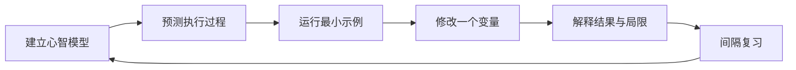

# 学习方法

## 不以记住 API 为目标

框架 API 会变化。更稳定的学习目标是回答：对象为什么存在、输入是什么、输出是什么、何时执行、是否产生副作用，以及替换实现时哪些约束不能丢失。

## 每章的正确顺序

1. 先读“本章解决的问题”和“核心心智模型”。
2. 不运行代码，先预测输入经过每一步后会变成什么。
3. 使用文档给出的 `uv run` 命令运行示例。
4. 修改一个输入或删除一行，观察真实结果是否符合预测。
5. 独立回答思考题，再请求严格评阅。

## 一次学习闭环

第一次学习重点是“看懂数据如何流动”，第二次才关注 API 参数，第三次再思考生产环境中的持久化、并发、安全与监控。不要在第一次接触时同时记住全部配置项。

## Java 类比的用法

Java 类比只帮助你找到熟悉的入口。例如 FastAPI `Depends` 可以帮助理解“依赖由外部提供”，但它不是 Spring 完整的 IoC 容器。只记类比而忽略差异，会造成新的误解。

## 如何提问

优先提出可以验证的问题：

- 这一行接收的实际类型和返回类型是什么？
- 如果不配置这个参数，默认行为是什么？
- 这是 Python 语法、框架约定，还是业务规则？
- 为什么 Demo 可以这么写，而生产项目不应该？
- 这个状态保存在哪里，进程重启后还存在吗？

## 每章结束后的自检

- 能否不看代码画出输入、处理、输出的顺序？
- 能否指出一个 Demo 写法在生产环境中的风险？
- 能否说明关键对象由谁创建、保存和关闭？
- 能否用 Java 类比帮助理解，同时说清类比不成立的地方？
- 能否只看官方 API 签名判断必填参数、返回类型和异常路径？
