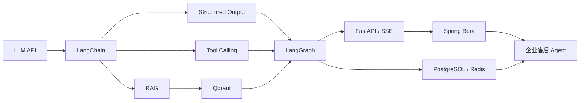

Java Backend → Enterprise Agent

# 从后端工程走向 Agent 工程

一套面向 Java 后端开发者的中文教程。沿着 **LangChain → RAG → LangGraph → 企业集成** 的依赖顺序，建立可以运行、解释、测试和演进的 Agent 工程能力。

[开始学习](course-overview.md){ .md-button .md-button--primary }
[查看学习方法](guide/learning-method.md){ .md-button }
[完整项目](https://github.com/MIRS571/Enterprise-Support-Agent){ .md-button }

**课程状态：** 12 章内容与离线示例全部完成，当前质量门槛为 86 个测试、Ruff 和 MkDocs 严格构建。

## 你会建立什么能力

- **LangChain 基础**

  理解 Message、Prompt、LCEL、Parser、Structured Output 与 Tool Calling 的输入输出边界。

- **企业级 RAG**

  完成 Document、切分、Embedding、Qdrant、多租户过滤、稳定 ID、引用和检索评估。

- **LangGraph 工作流**

  使用 State、Node、Edge、Checkpointer、Runtime 和 Interrupt 构建可恢复流程。

- **Java / Python 集成**

  通过 FastAPI、SSE、Spring WebClient、PostgreSQL、Redis 与 Docker 划分企业职责。

## 一条完整的学习主线

课程不要求先掌握模型训练，也不会要求死记框架 API。每章都从工程问题开始，依次说明技术动机、执行流程、最小实现和生产边界。

## 推荐入口

| 当前目标 | 阅读入口 |
| --- | --- |
| 第一次学习 | [课程路线](course-overview.md) → [第 1 章](chapter01/agent-and-llm-api.md) |
| 已了解基础概念 | [第 3 章 LangChain](chapter03/langchain-basics.md) |
| 重点学习知识库 | [第 5 章 RAG](chapter05/rag-basics.md) → [第 6 章 Qdrant](chapter06/enterprise-rag-with-qdrant.md) |
| 重点学习工作流 | [第 7 章 LangGraph](chapter07/langgraph-basics.md) → [第 8 章持久化](chapter08/persistence-runtime-interrupts.md) |
| 准备企业项目或面试 | [第 12 章综合案例](chapter12/enterprise-support-agent-walkthrough.md) → [面试复习问题](appendix/interview-questions.md) |

!!! note "内容完成不等于掌握"
    真正的验收标准是：能够独立解释一次请求的数据流和安全边界，运行示例，并根据异常定位到模型、检索、Graph、服务或基础设施层。
