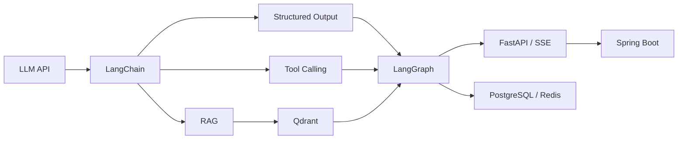

# Java Backend to Agent

这是一套面向 Java 后端开发者的企业级 AI Agent 工程教程。

课程不要求你先掌握模型训练，也不会让你一次记住大量框架 API。每一章从一个工程问题开始，依次说明为什么需要这项技术、数据怎样流动、最小代码怎样运行，以及进入企业项目后必须补充哪些约束。

## 课程重点

- **LangChain**：模型、消息、Prompt、结构化输出、工具和检索接口。
- **RAG**：把可更新、可追溯的外部知识接入模型回答流程。
- **LangGraph**：用显式状态和工作流组织多步骤 Agent。
- **企业集成**：让 Java 继续负责确定性业务，让 Python 负责模型和工作流。

## 从哪里开始

1. 阅读[课程路线](course-overview.md)。
2. 按[学习方法](guide/learning-method.md)运行示例。
3. 每章结束后先独立回答思考题，再检查自己的理解。
4. 遇到报错时使用[排查顺序](appendix/troubleshooting.md)，不要立即复制完整答案。

当前已完成[第 1 章：Agent、LLM API、消息、上下文与模型局限](chapter01/agent-and-llm-api.md)、[第 2 章：Python、uv、异步与 FastAPI](chapter02/python-uv-async-fastapi.md)和[第 3 章：LangChain 基础](chapter03/langchain-basics.md)，下一步为第 4 章 Structured Output 与 Tool Calling。
